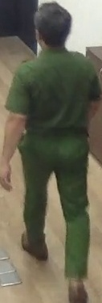

# Detection Analysis Report

**Generated on:** 2025-06-07 12:47:51  
**Model:** best.onnx  
**Confidence Threshold:** 0.3  
**NMS Threshold:** 0.4  

## Summary Statistics

| Metric | Value |
|--------|-------|
| Total Images Processed | 997 |
| Total Class 0 Detections | 849 |
| Total Class 1 Detections | 0 |
| Total Other/Unknown Classes | 0 |
| Average Process Time | 0.0300s |
| Total Process Time | 29.93s |

### Class Distribution

| Class ID | Class Name | Count |
|----------|------------|-------|
| 0 | CA | 849 |

## Detailed Results

| Image Name | Image Preview | Class ID | Class Name | Confidence | Raw Class Prob | Bounding Box (x,y,w,h) | Process Time (s) |
|------------|---------------|----------|------------|------------|----------------|-------------------------|------------------|
| frame_0466_person_1_conf0.83.jpg | - | 0 | CA | 0.710 | 0.000 | (39.4,49.2,208.1,249.2) | 0.0471 |
| frame_0467_person_1_conf0.78.jpg | - | 0 | CA | 0.770 | 0.000 | (40.3,55.0,203.5,243.8) | 0.0387 |
| frame_0468_person_1_conf0.87.jpg | - | 0 | CA | 0.719 | 0.000 | (39.0,52.2,208.5,245.1) | 0.0244 |
| frame_0469_person_1_conf0.85.jpg | - | 0 | CA | 0.795 | 0.000 | (35.9,52.6,200.5,252.6) | 0.0346 |
| frame_0470_person_1_conf0.81.jpg | - | 0 | CA | 0.787 | 0.000 | (38.4,56.3,197.4,260.0) | 0.0319 |
| frame_0471_person_1_conf0.80.jpg | - | 0 | CA | 0.795 | 0.000 | (33.8,53.0,195.3,266.2) | 0.0276 |
| frame_0472_person_1_conf0.57.jpg | - | 0 | CA | 0.736 | 0.000 | (38.7,52.9,185.8,275.1) | 0.0268 |
| frame_0473_person_1_conf0.86.jpg | - | 0 | CA | 0.797 | 0.000 | (41.7,55.0,180.6,276.9) | 0.0263 |
| frame_0474_person_1_conf0.87.jpg | - | 0 | CA | 0.704 | 0.000 | (40.8,57.6,180.0,282.2) | 0.0269 |
| frame_0475_person_1_conf0.87.jpg | - | 0 | CA | 0.804 | 0.000 | (39.4,53.4,176.3,287.8) | 0.0277 |
| frame_0476_person_1_conf0.70.jpg | - | 0 | CA | 0.747 | 0.000 | (35.4,43.3,174.1,303.0) | 0.0325 |
| frame_0477_person_1_conf0.82.jpg | - | 0 | CA | 0.713 | 0.000 | (23.5,43.1,188.6,307.5) | 0.0267 |
| frame_0478_person_1_conf0.66.jpg | - | 0 | CA | 0.654 | 0.000 | (15.9,32.4,192.3,336.7) | 0.0316 |
| frame_0479_person_1_conf0.79.jpg | - | 0 | CA | 0.730 | 0.000 | (21.0,38.5,179.5,337.2) | 0.0331 |
| frame_0480_person_1_conf0.77.jpg | - | 0 | CA | 0.748 | 0.000 | (28.4,42.9,166.5,334.8) | 0.0323 |
| frame_0481_person_1_conf0.82.jpg | - | 0 | CA | 0.624 | 0.000 | (21.9,53.0,179.0,338.2) | 0.0278 |
| frame_0482_person_1_conf0.66.jpg | - | 0 | CA | 0.654 | 0.000 | (26.9,73.5,177.6,329.8) | 0.0243 |
| frame_0483_person_1_conf0.68.jpg | - | 0 | CA | 0.646 | 0.000 | (21.0,64.0,177.5,345.1) | 0.0343 |
| frame_0484_person_1_conf0.57.jpg | - | 0 | CA | 0.664 | 0.000 | (19.0,72.4,174.2,339.9) | 0.0282 |
| frame_0485_person_1_conf0.56.jpg | - | 0 | CA | 0.672 | 0.000 | (21.8,68.9,163.7,341.2) | 0.0290 |
| frame_0486_person_1_conf0.51.jpg | - | 0 | CA | 0.690 | 0.000 | (22.0,67.6,157.8,351.6) | 0.0255 |
| frame_0487_person_1_conf0.85.jpg | - | 0 | CA | 0.658 | 0.000 | (20.8,70.3,154.6,348.6) | 0.0293 |
| frame_0488_person_1_conf0.86.jpg | - | 0 | CA | 0.645 | 0.000 | (29.8,61.5,142.7,355.9) | 0.0243 |
| frame_0489_person_1_conf0.88.jpg | - | 0 | CA | 0.679 | 0.000 | (27.3,62.5,144.0,346.7) | 0.0241 |
| frame_0490_person_1_conf0.85.jpg | - | 0 | CA | 0.620 | 0.000 | (33.0,74.8,136.6,346.6) | 0.0268 |
| frame_0491_person_1_conf0.85.jpg | - | 0 | CA | 0.662 | 0.000 | (30.8,66.3,136.8,358.4) | 0.0242 |
| frame_0492_person_1_conf0.83.jpg | - | 0 | CA | 0.656 | 0.000 | (28.2,78.6,131.1,354.3) | 0.0249 |
| frame_0493_person_1_conf0.88.jpg | - | 0 | CA | 0.620 | 0.000 | (31.1,66.7,128.4,366.5) | 0.0239 |
| frame_0494_person_1_conf0.85.jpg | - | 0 | CA | 0.609 | 0.000 | (30.0,62.0,134.1,376.0) | 0.0238 |
| frame_0495_person_1_conf0.87.jpg | - | 0 | CA | 0.586 | 0.000 | (32.2,59.6,141.9,367.3) | 0.0242 |
| frame_0496_person_1_conf0.87.jpg | - | 0 | CA | 0.553 | 0.000 | (33.2,61.4,137.5,360.8) | 0.0344 |
| frame_0497_person_1_conf0.88.jpg | - | 0 | CA | 0.599 | 0.000 | (33.7,56.9,134.1,381.1) | 0.0321 |
| frame_0498_person_1_conf0.88.jpg | - | 0 | CA | 0.625 | 0.000 | (33.3,54.8,146.8,355.4) | 0.0272 |
| frame_0499_person_1_conf0.89.jpg | - | 0 | CA | 0.519 | 0.000 | (27.8,54.4,147.4,347.6) | 0.0245 |
| frame_0500_person_1_conf0.87.jpg | - | 0 | CA | 0.488 | 0.000 | (31.4,44.6,140.2,367.3) | 0.0244 |
| frame_0501_person_1_conf0.85.jpg | - | 0 | CA | 0.610 | 0.000 | (34.2,44.8,150.5,387.2) | 0.0251 |
| frame_0502_person_1_conf0.84.jpg | - | 0 | CA | 0.612 | 0.000 | (34.0,43.2,144.2,384.5) | 0.0275 |
| frame_0503_person_1_conf0.86.jpg | - | 0 | CA | 0.657 | 0.000 | (31.3,47.2,139.0,386.5) | 0.0334 |
| frame_0504_person_1_conf0.84.jpg | - | 0 | CA | 0.655 | 0.000 | (31.6,45.4,136.7,365.2) | 0.0308 |
| frame_0505_person_1_conf0.85.jpg | - | 0 | CA | 0.608 | 0.000 | (31.3,47.0,137.7,384.7) | 0.0249 |
| frame_0506_person_1_conf0.84.jpg | - | 0 | CA | 0.596 | 0.000 | (28.5,48.2,138.4,393.1) | 0.0334 |
| frame_0507_person_1_conf0.81.jpg | - | 0 | CA | 0.501 | 0.000 | (29.4,50.7,129.7,402.0) | 0.0332 |
| frame_0508_person_1_conf0.81.jpg | - | 0 | CA | 0.520 | 0.000 | (28.6,41.6,128.9,421.2) | 0.0270 |
| frame_0509_person_1_conf0.82.jpg | - | 0 | CA | 0.639 | 0.000 | (29.1,55.7,120.9,300.0) | 0.0371 |
| frame_0510_person_1_conf0.77.jpg | - | 0 | CA | 0.585 | 0.000 | (29.3,55.0,115.5,319.4) | 0.0308 |
| frame_0511_person_1_conf0.82.jpg | - | 0 | CA | 0.540 | 0.000 | (26.1,54.5,117.9,311.2) | 0.0311 |
| frame_0512_person_1_conf0.85.jpg | - | 0 | CA | 0.554 | 0.000 | (29.3,48.5,112.2,318.0) | 0.0295 |
| frame_0513_person_1_conf0.87.jpg | - | 0 | CA | 0.509 | 0.000 | (26.7,30.9,114.2,312.2) | 0.0316 |
| frame_0514_person_1_conf0.88.jpg | - | 0 | CA | 0.597 | 0.000 | (22.5,39.1,112.3,286.1) | 0.0247 |
| frame_0515_person_1_conf0.90.jpg | - | 0 | CA | 0.556 | 0.000 | (25.8,39.3,108.9,285.2) | 0.0315 |
| frame_0516_person_1_conf0.88.jpg | - | 0 | CA | 0.480 | 0.000 | (28.4,33.5,107.8,296.4) | 0.0326 |
| frame_0517_person_1_conf0.86.jpg | - | 0 | CA | 0.555 | 0.000 | (26.1,25.8,103.4,309.9) | 0.0249 |
| frame_0518_person_1_conf0.86.jpg | - | 0 | CA | 0.516 | 0.000 | (25.9,28.8,102.9,320.2) | 0.0308 |
| frame_0519_person_1_conf0.84.jpg | - | 0 | CA | 0.389 | 0.000 | (26.8,33.6,103.3,332.3) | 0.0404 |
| frame_0520_person_1_conf0.68.jpg | - | 0 | CA | 0.435 | 0.000 | (27.7,41.1,97.9,328.8) | 0.0276 |
| frame_0521_person_1_conf0.89.jpg | - | 0 | CA | 0.520 | 0.000 | (27.2,55.2,97.5,320.3) | 0.0355 |
| frame_0522_person_1_conf0.82.jpg | - | 0 | CA | 0.551 | 0.000 | (26.3,60.9,96.8,323.1) | 0.0374 |
| frame_0523_person_1_conf0.83.jpg | - | 0 | CA | 0.465 | 0.000 | (27.0,55.1,100.0,314.6) | 0.0263 |
| frame_0524_person_1_conf0.80.jpg | - | 0 | CA | 0.357 | 0.000 | (25.9,23.4,100.6,351.0) | 0.0237 |
| frame_0525_person_1_conf0.73.jpg | - | 0 | CA | 0.316 | 0.000 | (21.1,14.6,92.6,363.7) | 0.0361 |
| frame_0526_person_1_conf0.52.jpg |  | - | No detections | - | - | - | 0.0426 |
| frame_0527_person_1_conf0.60.jpg | - | 0 | CA | 0.393 | 0.000 | (22.9,39.3,91.4,331.7) | 0.0316 |
| frame_0528_person_1_conf0.81.jpg | - | 0 | CA | 0.302 | 0.000 | (19.9,1.9,102.6,366.1) | 0.0265 |
| frame_0529_person_1_conf0.81.jpg | - | 0 | CA | 0.486 | 0.000 | (21.9,3.2,96.4,314.8) | 0.0418 |
| frame_0530_person_1_conf0.85.jpg | - | 0 | CA | 0.404 | 0.000 | (13.8,4.0,101.5,302.0) | 0.0268 |
| frame_0531_person_1_conf0.87.jpg | - | 0 | CA | 0.530 | 0.000 | (17.6,14.8,93.9,289.2) | 0.0285 |
| frame_0532_person_1_conf0.87.jpg | - | 0 | CA | 0.494 | 0.000 | (21.4,6.9,100.1,302.2) | 0.0259 |
| frame_0533_person_1_conf0.86.jpg | - | 0 | CA | 0.440 | 0.000 | (24.0,15.1,94.1,285.0) | 0.0274 |
| frame_0534_person_1_conf0.83.jpg | - | 0 | CA | 0.416 | 0.000 | (24.9,8.4,100.1,298.3) | 0.0257 |
| frame_0535_person_1_conf0.79.jpg | - | 0 | CA | 0.411 | 0.000 | (24.5,7.9,96.9,297.6) | 0.0301 |
| frame_0536_person_1_conf0.78.jpg | - | 0 | CA | 0.380 | 0.000 | (23.8,9.5,103.3,325.4) | 0.0277 |
| frame_0537_person_1_conf0.81.jpg | - | 0 | CA | 0.397 | 0.000 | (23.4,14.8,103.3,308.3) | 0.0358 |
| frame_0538_person_1_conf0.79.jpg | - | 0 | CA | 0.429 | 0.000 | (23.0,17.8,98.2,307.1) | 0.0285 |
| frame_0539_person_1_conf0.76.jpg | - | 0 | CA | 0.376 | 0.000 | (22.3,43.5,105.7,274.3) | 0.0321 |
| frame_0540_person_1_conf0.74.jpg | - | 0 | CA | 0.459 | 0.000 | (20.8,16.6,105.7,319.4) | 0.0297 |
| frame_0541_person_1_conf0.72.jpg | - | 0 | CA | 0.526 | 0.000 | (23.1,46.5,97.7,285.8) | 0.0266 |
| frame_0542_person_1_conf0.69.jpg | - | 0 | CA | 0.457 | 0.000 | (19.4,24.0,105.8,295.4) | 0.0246 |
| frame_0543_person_1_conf0.77.jpg | - | 0 | CA | 0.560 | 0.000 | (20.2,46.5,98.4,281.0) | 0.0275 |
| frame_0544_person_1_conf0.84.jpg | - | 0 | CA | 0.525 | 0.000 | (22.8,39.2,93.0,273.9) | 0.0262 |
| frame_0545_person_1_conf0.84.jpg | - | 0 | CA | 0.594 | 0.000 | (21.5,24.4,95.9,281.6) | 0.0324 |
| frame_0546_person_1_conf0.83.jpg | - | 0 | CA | 0.669 | 0.000 | (19.9,46.8,91.7,258.9) | 0.0273 |
| frame_0547_person_1_conf0.83.jpg | - | 0 | CA | 0.680 | 0.000 | (22.3,28.9,82.1,257.7) | 0.0251 |
| frame_0548_person_1_conf0.73.jpg | - | 0 | CA | 0.547 | 0.000 | (23.0,36.8,81.5,250.5) | 0.0305 |
| frame_0549_person_1_conf0.76.jpg | - | 0 | CA | 0.593 | 0.000 | (20.5,15.1,78.7,256.7) | 0.0265 |
| frame_0550_person_1_conf0.76.jpg | - | 0 | CA | 0.538 | 0.000 | (18.0,34.3,80.7,231.0) | 0.0271 |
| frame_0551_person_1_conf0.66.jpg | - | 0 | CA | 0.457 | 0.000 | (19.3,9.6,77.3,266.5) | 0.0316 |
| frame_0552_person_1_conf0.69.jpg | - | 0 | CA | 0.444 | 0.000 | (20.5,0.0,78.6,282.7) | 0.0366 |
| frame_0554_person_1_conf0.62.jpg | - | 0 | CA | 0.354 | 0.000 | (12.5,0.0,81.4,294.0) | 0.0309 |
| frame_0555_person_1_conf0.50.jpg | - | 0 | CA | 0.460 | 0.000 | (18.0,0.0,74.1,276.3) | 0.0372 |
| frame_0557_person_1_conf0.61.jpg | - | 0 | CA | 0.438 | 0.000 | (15.2,15.6,70.3,278.6) | 0.0400 |
| frame_0558_person_1_conf0.65.jpg | - | 0 | CA | 0.605 | 0.000 | (12.1,17.9,67.0,250.1) | 0.0248 |
| frame_0559_person_1_conf0.66.jpg | - | 0 | CA | 0.490 | 0.000 | (16.0,14.5,64.4,252.0) | 0.0318 |
| frame_0560_person_1_conf0.67.jpg | - | 0 | CA | 0.360 | 0.000 | (14.2,10.2,70.5,253.3) | 0.0248 |
| frame_0561_person_1_conf0.63.jpg | - | 0 | CA | 0.472 | 0.000 | (14.3,5.4,78.5,243.5) | 0.0280 |
| frame_0562_person_1_conf0.52.jpg | - | 0 | CA | 0.533 | 0.000 | (15.4,1.6,72.6,255.9) | 0.0293 |
| frame_0563_person_1_conf0.56.jpg | - | 0 | CA | 0.585 | 0.000 | (15.6,5.6,73.2,249.9) | 0.0264 |
| frame_0564_person_1_conf0.58.jpg | - | 0 | CA | 0.418 | 0.000 | (17.2,3.8,73.4,248.5) | 0.0256 |
| frame_0565_person_1_conf0.57.jpg | - | 0 | CA | 0.444 | 0.000 | (18.0,9.5,76.1,233.7) | 0.0326 |
| frame_0566_person_1_conf0.73.jpg | - | 0 | CA | 0.394 | 0.000 | (20.7,3.5,72.4,248.3) | 0.0336 |
| frame_0567_person_1_conf0.70.jpg | - | 0 | CA | 0.508 | 0.000 | (19.7,10.1,79.8,247.0) | 0.0235 |
| frame_0568_person_1_conf0.74.jpg | - | 0 | CA | 0.464 | 0.000 | (20.1,0.2,81.7,251.3) | 0.0259 |
| frame_0569_person_1_conf0.77.jpg | - | 0 | CA | 0.552 | 0.000 | (14.8,9.6,97.3,224.3) | 0.0250 |
| frame_0570_person_1_conf0.77.jpg | - | 0 | CA | 0.594 | 0.000 | (16.9,4.9,93.8,228.5) | 0.0291 |
| frame_0571_person_1_conf0.75.jpg | - | 0 | CA | 0.561 | 0.000 | (14.5,15.5,99.3,215.2) | 0.0358 |
| frame_0572_person_1_conf0.76.jpg | - | 0 | CA | 0.573 | 0.000 | (17.6,9.1,98.4,250.5) | 0.0381 |
| frame_0573_person_1_conf0.76.jpg | - | 0 | CA | 0.545 | 0.000 | (22.5,24.3,93.0,211.0) | 0.0330 |
| frame_0574_person_1_conf0.75.jpg | - | 0 | CA | 0.656 | 0.000 | (22.3,32.4,93.4,194.1) | 0.0258 |
| frame_0575_person_1_conf0.73.jpg | - | 0 | CA | 0.652 | 0.000 | (21.3,35.3,83.1,180.0) | 0.0259 |
| frame_0576_person_1_conf0.72.jpg | - | 0 | CA | 0.639 | 0.000 | (21.8,32.7,84.6,173.3) | 0.0248 |
| frame_0577_person_1_conf0.72.jpg | - | 0 | CA | 0.649 | 0.000 | (19.1,25.0,85.1,212.5) | 0.0269 |
| frame_0578_person_1_conf0.74.jpg | - | 0 | CA | 0.643 | 0.000 | (19.4,16.2,78.6,214.1) | 0.0237 |
| frame_0579_person_1_conf0.78.jpg | - | 0 | CA | 0.607 | 0.000 | (18.2,22.1,81.6,203.0) | 0.0232 |
| frame_0580_person_1_conf0.80.jpg | - | 0 | CA | 0.521 | 0.000 | (18.1,19.0,75.0,208.2) | 0.0235 |
| frame_0581_person_1_conf0.81.jpg | - | 0 | CA | 0.588 | 0.000 | (18.7,15.3,73.9,208.8) | 0.0232 |
| frame_0582_person_1_conf0.78.jpg | - | 0 | CA | 0.549 | 0.000 | (18.9,4.7,67.2,214.9) | 0.0239 |
| frame_0583_person_1_conf0.78.jpg | - | 0 | CA | 0.633 | 0.000 | (18.8,7.6,64.9,211.5) | 0.0267 |
| frame_0584_person_1_conf0.76.jpg | - | 0 | CA | 0.628 | 0.000 | (18.2,2.6,65.6,217.7) | 0.0282 |
| frame_0585_person_1_conf0.77.jpg | - | 0 | CA | 0.596 | 0.000 | (17.9,3.2,63.8,221.3) | 0.0279 |
| frame_0586_person_1_conf0.78.jpg | - | 0 | CA | 0.502 | 0.000 | (18.9,0.5,61.8,223.3) | 0.0244 |
| frame_0587_person_1_conf0.77.jpg | - | 0 | CA | 0.548 | 0.000 | (18.0,0.0,60.0,225.1) | 0.0254 |
| frame_0588_person_1_conf0.75.jpg | - | 0 | CA | 0.604 | 0.000 | (16.5,0.0,59.1,220.7) | 0.0251 |
| frame_0589_person_1_conf0.70.jpg | - | 0 | CA | 0.573 | 0.000 | (15.7,0.0,58.4,227.5) | 0.0248 |
| frame_0590_person_1_conf0.60.jpg | - | 0 | CA | 0.603 | 0.000 | (15.7,0.0,59.4,227.0) | 0.0239 |
| frame_0591_person_1_conf0.66.jpg | - | 0 | CA | 0.635 | 0.000 | (14.2,0.0,59.1,227.5) | 0.0289 |
| frame_0592_person_1_conf0.73.jpg | - | 0 | CA | 0.502 | 0.000 | (15.0,0.0,58.5,228.9) | 0.0297 |
| frame_0593_person_1_conf0.63.jpg | - | 0 | CA | 0.627 | 0.000 | (15.3,11.5,61.4,211.9) | 0.0377 |
| frame_0594_person_1_conf0.78.jpg | - | 0 | CA | 0.504 | 0.000 | (18.5,0.0,60.7,224.1) | 0.0246 |
| frame_0595_person_1_conf0.82.jpg | - | 0 | CA | 0.578 | 0.000 | (16.8,0.0,62.1,227.2) | 0.0320 |
| frame_0596_person_1_conf0.82.jpg | - | 0 | CA | 0.549 | 0.000 | (19.2,0.0,62.6,222.2) | 0.0276 |
| frame_0597_person_1_conf0.79.jpg | - | 0 | CA | 0.516 | 0.000 | (19.1,0.0,64.3,214.4) | 0.0246 |
| frame_0598_person_1_conf0.77.jpg | - | 0 | CA | 0.405 | 0.000 | (18.6,0.0,64.6,219.6) | 0.0261 |
| frame_0599_person_1_conf0.81.jpg | - | 0 | CA | 0.499 | 0.000 | (18.2,2.0,65.8,207.4) | 0.0247 |
| frame_0600_person_1_conf0.80.jpg | - | 0 | CA | 0.539 | 0.000 | (19.6,6.8,61.2,198.6) | 0.0307 |
| frame_0601_person_1_conf0.79.jpg | - | 0 | CA | 0.592 | 0.000 | (19.3,1.3,61.6,203.2) | 0.0292 |
| frame_0602_person_1_conf0.77.jpg | - | 0 | CA | 0.468 | 0.000 | (20.5,1.0,61.7,196.5) | 0.0272 |
| frame_0603_person_1_conf0.77.jpg | - | 0 | CA | 0.404 | 0.000 | (18.1,8.9,65.0,194.1) | 0.0281 |
| frame_0604_person_1_conf0.77.jpg | - | 0 | CA | 0.438 | 0.000 | (20.7,6.3,64.2,190.3) | 0.0275 |
| frame_0605_person_1_conf0.79.jpg | - | 0 | CA | 0.396 | 0.000 | (19.5,8.0,65.4,185.8) | 0.0249 |
| frame_0606_person_1_conf0.78.jpg | - | 0 | CA | 0.445 | 0.000 | (19.6,4.2,64.1,187.1) | 0.0375 |
| frame_0607_person_1_conf0.80.jpg | - | 0 | CA | 0.482 | 0.000 | (13.5,13.6,67.8,195.3) | 0.0257 |
| frame_0608_person_1_conf0.78.jpg | - | 0 | CA | 0.360 | 0.000 | (14.2,12.9,65.7,193.4) | 0.0242 |
| frame_0609_person_1_conf0.78.jpg | - | 0 | CA | 0.373 | 0.000 | (13.4,13.9,66.1,193.5) | 0.0293 |
| frame_0610_person_1_conf0.76.jpg | - | 0 | CA | 0.389 | 0.000 | (14.0,11.6,64.9,186.9) | 0.0275 |
| frame_0611_person_1_conf0.75.jpg | - | 0 | CA | 0.481 | 0.000 | (13.5,2.1,61.5,184.5) | 0.0265 |
| frame_0612_person_1_conf0.77.jpg | - | 0 | CA | 0.496 | 0.000 | (18.7,1.4,58.5,184.5) | 0.0289 |
| frame_0613_person_1_conf0.77.jpg | - | 0 | CA | 0.531 | 0.000 | (18.0,2.6,56.8,188.6) | 0.0327 |
| frame_0614_person_1_conf0.83.jpg | - | 0 | CA | 0.582 | 0.000 | (17.7,1.7,58.3,183.5) | 0.0261 |
| frame_0615_person_1_conf0.81.jpg | - | 0 | CA | 0.629 | 0.000 | (17.5,2.4,58.3,185.2) | 0.0293 |
| frame_0616_person_1_conf0.81.jpg | - | 0 | CA | 0.517 | 0.000 | (18.5,1.5,59.1,184.8) | 0.0237 |
| frame_0617_person_1_conf0.78.jpg | - | 0 | CA | 0.574 | 0.000 | (18.0,2.1,58.2,184.1) | 0.0263 |
| frame_0618_person_1_conf0.75.jpg | - | 0 | CA | 0.605 | 0.000 | (17.3,2.6,57.6,185.3) | 0.0317 |
| frame_0619_person_1_conf0.69.jpg | - | 0 | CA | 0.579 | 0.000 | (17.2,2.9,57.6,184.5) | 0.0280 |
| frame_0620_person_1_conf0.71.jpg | - | 0 | CA | 0.498 | 0.000 | (15.8,1.7,56.8,180.5) | 0.0244 |
| frame_0621_person_1_conf0.69.jpg | - | 0 | CA | 0.527 | 0.000 | (16.5,1.6,54.7,183.4) | 0.0270 |
| frame_0622_person_1_conf0.61.jpg | - | 0 | CA | 0.520 | 0.000 | (16.5,1.4,55.5,189.4) | 0.0338 |
| frame_0623_person_1_conf0.64.jpg | - | 0 | CA | 0.718 | 0.000 | (14.5,9.1,57.0,134.9) | 0.0246 |
| frame_0624_person_1_conf0.69.jpg | - | 0 | CA | 0.584 | 0.000 | (16.9,0.8,54.4,184.5) | 0.0263 |
| frame_0625_person_1_conf0.75.jpg | - | 0 | CA | 0.532 | 0.000 | (16.8,0.2,55.8,181.4) | 0.0339 |
| frame_0626_person_1_conf0.75.jpg | - | 0 | CA | 0.524 | 0.000 | (17.8,0.0,53.5,176.1) | 0.0346 |
| frame_0627_person_1_conf0.72.jpg | - | 0 | CA | 0.491 | 0.000 | (17.7,0.0,54.6,196.4) | 0.0271 |
| frame_0628_person_1_conf0.70.jpg | - | 0 | CA | 0.454 | 0.000 | (16.7,1.3,54.5,174.7) | 0.0263 |
| frame_0629_person_1_conf0.73.jpg | - | 0 | CA | 0.657 | 0.000 | (14.4,13.6,55.6,125.1) | 0.0260 |
| frame_0630_person_1_conf0.68.jpg | - | 0 | CA | 0.684 | 0.000 | (12.0,9.0,58.4,133.6) | 0.0382 |
| frame_0631_person_1_conf0.76.jpg | - | 0 | CA | 0.638 | 0.000 | (9.9,13.2,59.0,129.1) | 0.0344 |
| frame_0632_person_1_conf0.73.jpg | - | 0 | CA | 0.537 | 0.000 | (12.6,8.2,57.1,137.6) | 0.0241 |
| frame_0633_person_1_conf0.75.jpg | - | 0 | CA | 0.600 | 0.000 | (12.7,7.7,57.3,136.0) | 0.0300 |
| frame_0634_person_1_conf0.70.jpg | - | 0 | CA | 0.613 | 0.000 | (9.1,6.4,59.1,136.6) | 0.0285 |
| frame_0635_person_1_conf0.71.jpg | - | 0 | CA | 0.691 | 0.000 | (9.7,9.8,59.6,132.0) | 0.0297 |
| frame_0636_person_1_conf0.72.jpg | - | 0 | CA | 0.631 | 0.000 | (5.5,5.5,60.3,141.2) | 0.0331 |
| frame_0637_person_1_conf0.78.jpg | - | 0 | CA | 0.530 | 0.000 | (12.5,4.4,55.7,184.1) | 0.0311 |
| frame_0638_person_1_conf0.79.jpg | - | 0 | CA | 0.516 | 0.000 | (12.9,2.7,56.3,183.2) | 0.0330 |
| frame_0639_person_1_conf0.81.jpg | - | 0 | CA | 0.521 | 0.000 | (13.8,4.8,58.2,184.5) | 0.0254 |
| frame_0640_person_1_conf0.81.jpg | - | 0 | CA | 0.524 | 0.000 | (13.9,1.5,58.1,185.7) | 0.0246 |
| frame_0641_person_1_conf0.82.jpg | - | 0 | CA | 0.538 | 0.000 | (13.0,1.8,59.4,183.7) | 0.0266 |
| frame_0642_person_1_conf0.82.jpg | - | 0 | CA | 0.545 | 0.000 | (14.2,0.7,59.3,177.0) | 0.0254 |
| frame_0643_person_1_conf0.81.jpg | - | 0 | CA | 0.461 | 0.000 | (13.5,0.3,57.5,177.6) | 0.0252 |
| frame_0644_person_1_conf0.81.jpg | - | 0 | CA | 0.450 | 0.000 | (13.5,0.8,57.7,179.3) | 0.0352 |
| frame_0645_person_1_conf0.79.jpg | - | 0 | CA | 0.484 | 0.000 | (14.4,2.2,56.6,182.4) | 0.0367 |
| frame_0646_person_1_conf0.77.jpg | - | 0 | CA | 0.445 | 0.000 | (13.5,0.0,57.6,185.2) | 0.0247 |
| frame_0647_person_1_conf0.73.jpg | - | 0 | CA | 0.455 | 0.000 | (13.9,11.6,53.2,166.2) | 0.0266 |
| frame_0648_person_1_conf0.72.jpg | - | 0 | CA | 0.354 | 0.000 | (12.0,0.0,51.5,197.7) | 0.0282 |
| frame_0649_person_1_conf0.74.jpg | - | 0 | CA | 0.360 | 0.000 | (13.7,9.3,51.0,168.9) | 0.0238 |
| frame_0650_person_1_conf0.75.jpg |  | - | No detections | - | - | - | 0.0245 |
| frame_0651_person_1_conf0.74.jpg | - | 0 | CA | 0.416 | 0.000 | (12.2,0.0,48.9,192.2) | 0.0294 |
| frame_0652_person_1_conf0.74.jpg | - | 0 | CA | 0.392 | 0.000 | (11.6,0.0,42.2,156.9) | 0.0343 |
| frame_0653_person_1_conf0.75.jpg | - | 0 | CA | 0.546 | 0.000 | (12.4,10.1,46.6,157.4) | 0.0246 |
| frame_0654_person_1_conf0.76.jpg | - | 0 | CA | 0.435 | 0.000 | (11.3,0.2,45.4,174.6) | 0.0286 |
| frame_0655_person_1_conf0.75.jpg | - | 0 | CA | 0.395 | 0.000 | (11.9,0.3,44.8,175.0) | 0.0445 |
| frame_0656_person_1_conf0.74.jpg | - | 0 | CA | 0.371 | 0.000 | (11.7,1.1,44.1,167.4) | 0.0318 |
| frame_0657_person_1_conf0.75.jpg | - | 0 | CA | 0.591 | 0.000 | (9.9,2.4,43.7,160.8) | 0.0407 |
| frame_0658_person_1_conf0.74.jpg | - | 0 | CA | 0.647 | 0.000 | (10.8,0.0,42.9,166.9) | 0.0315 |
| frame_0659_person_1_conf0.72.jpg | - | 0 | CA | 0.522 | 0.000 | (13.6,0.0,41.7,160.6) | 0.0324 |
| frame_0660_person_1_conf0.74.jpg | - | 0 | CA | 0.386 | 0.000 | (14.2,5.2,51.8,157.1) | 0.0347 |
| frame_0661_person_1_conf0.73.jpg | - | 0 | CA | 0.433 | 0.000 | (14.6,6.2,55.2,169.3) | 0.0318 |
| frame_0662_person_1_conf0.72.jpg | - | 0 | CA | 0.434 | 0.000 | (13.6,14.3,56.0,165.7) | 0.0384 |
| frame_0663_person_1_conf0.66.jpg | - | 0 | CA | 0.565 | 0.000 | (11.8,10.7,55.8,181.2) | 0.0399 |
| frame_0664_person_1_conf0.71.jpg | - | 0 | CA | 0.603 | 0.000 | (12.3,18.6,54.6,176.0) | 0.0248 |
| frame_0665_person_1_conf0.70.jpg | - | 0 | CA | 0.525 | 0.000 | (12.2,15.4,51.8,177.6) | 0.0250 |
| frame_0666_person_1_conf0.69.jpg | - | 0 | CA | 0.488 | 0.000 | (8.7,12.4,51.9,183.0) | 0.0275 |
| frame_0667_person_1_conf0.71.jpg | - | 0 | CA | 0.542 | 0.000 | (10.3,9.0,53.7,186.1) | 0.0275 |
| frame_0668_person_1_conf0.72.jpg | - | 0 | CA | 0.578 | 0.000 | (11.6,16.9,54.1,176.9) | 0.0274 |
| frame_0669_person_1_conf0.75.jpg | - | 0 | CA | 0.636 | 0.000 | (12.8,25.8,55.6,166.5) | 0.0277 |
| frame_0670_person_1_conf0.77.jpg | - | 0 | CA | 0.501 | 0.000 | (13.2,5.8,55.5,176.6) | 0.0284 |
| frame_0671_person_1_conf0.77.jpg | - | 0 | CA | 0.482 | 0.000 | (16.6,21.9,51.4,147.1) | 0.0243 |
| frame_0672_person_1_conf0.76.jpg | - | 0 | CA | 0.525 | 0.000 | (16.1,10.4,55.7,176.0) | 0.0379 |
| frame_0673_person_1_conf0.71.jpg | - | 0 | CA | 0.447 | 0.000 | (15.2,20.5,53.6,177.1) | 0.0307 |
| frame_0674_person_1_conf0.71.jpg | - | 0 | CA | 0.301 | 0.000 | (13.9,0.0,51.7,193.7) | 0.0261 |
| frame_0675_person_1_conf0.72.jpg | - | 0 | CA | 0.313 | 0.000 | (17.1,24.0,48.5,169.3) | 0.0276 |
| frame_0676_person_1_conf0.77.jpg |  | - | No detections | - | - | - | 0.0260 |
| frame_0677_person_1_conf0.80.jpg |  | - | No detections | - | - | - | 0.0284 |
| frame_0678_person_1_conf0.75.jpg |  | - | No detections | - | - | - | 0.0314 |
| frame_0679_person_1_conf0.78.jpg |  | - | No detections | - | - | - | 0.0332 |
| frame_0680_person_1_conf0.80.jpg |  | - | No detections | - | - | - | 0.0294 |
| frame_0681_person_1_conf0.80.jpg |  | - | No detections | - | - | - | 0.0352 |
| frame_0682_person_1_conf0.78.jpg |  | - | No detections | - | - | - | 0.0323 |
| frame_0683_person_1_conf0.76.jpg |  | - | No detections | - | - | - | 0.0300 |
| frame_0684_person_1_conf0.77.jpg |  | - | No detections | - | - | - | 0.0254 |
| frame_0685_person_1_conf0.77.jpg |  | - | No detections | - | - | - | 0.0275 |
| frame_0686_person_1_conf0.78.jpg | - | 0 | CA | 0.451 | 0.000 | (13.0,29.7,61.7,160.4) | 0.0418 |
| frame_0687_person_1_conf0.81.jpg | - | 0 | CA | 0.343 | 0.000 | (16.6,22.5,63.3,160.1) | 0.0323 |
| frame_0688_person_1_conf0.83.jpg | - | 0 | CA | 0.494 | 0.000 | (14.4,27.3,57.6,152.3) | 0.0428 |
| frame_0689_person_1_conf0.82.jpg |  | - | No detections | - | - | - | 0.0279 |
| frame_0690_person_1_conf0.82.jpg | - | 0 | CA | 0.548 | 0.000 | (15.3,27.8,61.9,154.8) | 0.0368 |
| frame_0691_person_1_conf0.80.jpg | - | 0 | CA | 0.414 | 0.000 | (15.6,25.0,61.1,140.7) | 0.0355 |
| frame_0692_person_1_conf0.77.jpg | - | 0 | CA | 0.513 | 0.000 | (14.4,27.6,62.4,140.2) | 0.0344 |
| frame_0693_person_1_conf0.60.jpg | - | 0 | CA | 0.494 | 0.000 | (15.3,24.8,63.4,139.1) | 0.0306 |
| frame_0694_person_1_conf0.73.jpg | - | 0 | CA | 0.304 | 0.000 | (12.8,31.8,56.8,132.8) | 0.0246 |
| frame_0695_person_1_conf0.78.jpg |  | - | No detections | - | - | - | 0.0368 |
| frame_0696_person_1_conf0.79.jpg |  | - | No detections | - | - | - | 0.0276 |
| frame_0697_person_1_conf0.77.jpg |  | - | No detections | - | - | - | 0.0247 |
| frame_0698_person_1_conf0.76.jpg |  | - | No detections | - | - | - | 0.0264 |
| frame_0699_person_1_conf0.77.jpg |  | - | No detections | - | - | - | 0.0459 |
| frame_0700_person_1_conf0.77.jpg |  | - | No detections | - | - | - | 0.0293 |
| frame_0701_person_1_conf0.73.jpg |  | - | No detections | - | - | - | 0.0409 |
| frame_0702_person_1_conf0.69.jpg |  | - | No detections | - | - | - | 0.0351 |
| frame_0703_person_1_conf0.66.jpg |  | - | No detections | - | - | - | 0.0232 |
| frame_0705_person_1_conf0.62.jpg |  | - | No detections | - | - | - | 0.0233 |
| frame_0706_person_1_conf0.64.jpg |  | - | No detections | - | - | - | 0.0236 |
| frame_0707_person_1_conf0.51.jpg |  | - | No detections | - | - | - | 0.0249 |
| frame_0708_person_1_conf0.74.jpg |  | - | No detections | - | - | - | 0.0238 |
| frame_0709_person_1_conf0.77.jpg |  | - | No detections | - | - | - | 0.0286 |
| frame_0710_person_1_conf0.73.jpg |  | - | No detections | - | - | - | 0.0317 |
| frame_0711_person_1_conf0.73.jpg |  | - | No detections | - | - | - | 0.0266 |
| frame_0712_person_1_conf0.77.jpg |  | - | No detections | - | - | - | 0.0282 |
| frame_0713_person_1_conf0.76.jpg |  | - | No detections | - | - | - | 0.0254 |
| frame_0714_person_1_conf0.75.jpg |  | - | No detections | - | - | - | 0.0258 |
| frame_0715_person_1_conf0.79.jpg | - | 0 | CA | 0.373 | 0.000 | (11.6,13.4,50.7,174.2) | 0.0662 |
| frame_0716_person_1_conf0.79.jpg | - | 0 | CA | 0.424 | 0.000 | (11.5,8.4,55.6,185.5) | 0.0359 |
| frame_0717_person_1_conf0.77.jpg | - | 0 | CA | 0.470 | 0.000 | (11.3,12.0,54.0,189.5) | 0.0250 |
| frame_0718_person_1_conf0.76.jpg |  | - | No detections | - | - | - | 0.0301 |
| frame_0719_person_1_conf0.79.jpg |  | - | No detections | - | - | - | 0.0269 |
| frame_0720_person_1_conf0.79.jpg |  | - | No detections | - | - | - | 0.0280 |
| frame_0721_person_1_conf0.78.jpg |  | - | No detections | - | - | - | 0.0355 |
| frame_0722_person_1_conf0.78.jpg |  | - | No detections | - | - | - | 0.0234 |
| frame_0723_person_1_conf0.80.jpg | - | 0 | CA | 0.416 | 0.000 | (10.3,12.0,42.0,188.2) | 0.0272 |
| frame_0724_person_1_conf0.79.jpg | - | 0 | CA | 0.381 | 0.000 | (8.7,0.4,44.5,203.1) | 0.0243 |
| frame_0725_person_1_conf0.78.jpg |  | - | No detections | - | - | - | 0.0244 |
| frame_0726_person_1_conf0.77.jpg | - | 0 | CA | 0.370 | 0.000 | (8.8,5.8,49.1,197.2) | 0.0243 |
| frame_0727_person_1_conf0.78.jpg |  | - | No detections | - | - | - | 0.0250 |
| frame_0728_person_1_conf0.78.jpg | - | 0 | CA | 0.390 | 0.000 | (6.5,0.0,48.0,206.0) | 0.0394 |
| frame_0729_person_1_conf0.76.jpg | - | 0 | CA | 0.375 | 0.000 | (9.7,0.0,58.3,204.3) | 0.0259 |
| frame_0730_person_1_conf0.76.jpg | - | 0 | CA | 0.373 | 0.000 | (7.2,0.0,51.4,202.0) | 0.0426 |
| frame_0731_person_1_conf0.75.jpg | - | 0 | CA | 0.380 | 0.000 | (7.5,0.0,52.5,206.0) | 0.0261 |
| frame_0732_person_1_conf0.73.jpg | - | 0 | CA | 0.454 | 0.000 | (8.8,0.7,54.6,203.1) | 0.0280 |
| frame_0733_person_1_conf0.72.jpg | - | 0 | CA | 0.440 | 0.000 | (10.8,7.2,52.2,194.4) | 0.0311 |
| frame_0734_person_1_conf0.74.jpg | - | 0 | CA | 0.354 | 0.000 | (9.5,0.9,55.9,184.5) | 0.0377 |
| frame_0735_person_1_conf0.74.jpg | - | 0 | CA | 0.470 | 0.000 | (9.6,0.0,56.3,196.3) | 0.0262 |
| frame_0736_person_1_conf0.76.jpg | - | 0 | CA | 0.433 | 0.000 | (11.6,0.0,55.5,201.0) | 0.0271 |
| frame_0737_person_1_conf0.79.jpg | - | 0 | CA | 0.536 | 0.000 | (10.6,0.3,61.3,194.2) | 0.0368 |
| frame_0738_person_1_conf0.79.jpg | - | 0 | CA | 0.508 | 0.000 | (9.1,0.3,66.1,191.7) | 0.0259 |
| frame_0739_person_1_conf0.77.jpg | - | 0 | CA | 0.474 | 0.000 | (9.3,0.2,62.6,189.7) | 0.0262 |
| frame_0740_person_1_conf0.74.jpg | - | 0 | CA | 0.512 | 0.000 | (10.9,0.0,67.9,181.5) | 0.0369 |
| frame_0741_person_1_conf0.69.jpg | - | 0 | CA | 0.502 | 0.000 | (10.6,27.4,63.5,154.7) | 0.0324 |
| frame_0742_person_1_conf0.69.jpg | - | 0 | CA | 0.504 | 0.000 | (12.9,0.1,67.1,188.7) | 0.0318 |
| frame_0743_person_1_conf0.67.jpg | - | 0 | CA | 0.418 | 0.000 | (11.0,2.2,60.0,178.8) | 0.0378 |
| frame_0744_person_1_conf0.67.jpg | - | 0 | CA | 0.384 | 0.000 | (12.4,2.1,60.7,180.7) | 0.0466 |
| frame_0745_person_1_conf0.64.jpg | - | 0 | CA | 0.345 | 0.000 | (14.2,0.0,66.2,180.0) | 0.0238 |
| frame_0746_person_1_conf0.64.jpg | - | 0 | CA | 0.399 | 0.000 | (15.6,0.0,66.4,175.2) | 0.0313 |
| frame_0747_person_1_conf0.66.jpg | - | 0 | CA | 0.386 | 0.000 | (15.7,20.9,65.8,159.5) | 0.0268 |
| frame_0748_person_1_conf0.67.jpg |  | - | No detections | - | - | - | 0.0353 |
| frame_0749_person_1_conf0.64.jpg | - | 0 | CA | 0.399 | 0.000 | (14.5,15.5,60.9,161.0) | 0.0264 |
| frame_0750_person_1_conf0.66.jpg | - | 0 | CA | 0.424 | 0.000 | (11.7,1.1,61.2,175.3) | 0.0260 |
| frame_0751_person_1_conf0.66.jpg | - | 0 | CA | 0.471 | 0.000 | (15.1,13.9,63.2,151.7) | 0.0254 |
| frame_0752_person_1_conf0.63.jpg | - | 0 | CA | 0.455 | 0.000 | (13.1,1.9,62.1,170.1) | 0.0323 |
| frame_0753_person_1_conf0.63.jpg | - | 0 | CA | 0.425 | 0.000 | (9.6,0.0,62.3,171.0) | 0.0271 |
| frame_0754_person_1_conf0.64.jpg | - | 0 | CA | 0.429 | 0.000 | (15.5,6.9,66.7,165.9) | 0.0258 |
| frame_0755_person_1_conf0.70.jpg | - | 0 | CA | 0.450 | 0.000 | (15.6,12.6,67.3,141.9) | 0.0281 |
| frame_0756_person_1_conf0.69.jpg | - | 0 | CA | 0.462 | 0.000 | (13.4,0.0,62.5,158.2) | 0.0277 |
| frame_0757_person_1_conf0.71.jpg | - | 0 | CA | 0.481 | 0.000 | (9.8,1.0,63.4,166.6) | 0.0346 |
| frame_0758_person_1_conf0.71.jpg | - | 0 | CA | 0.482 | 0.000 | (13.4,21.7,59.7,140.7) | 0.0285 |
| frame_0759_person_1_conf0.74.jpg | - | 0 | CA | 0.486 | 0.000 | (13.6,0.0,71.3,160.3) | 0.0239 |
|  | - | 0 | CA | 0.447 | 0.000 | (11.9,21.8,63.4,142.3) |  |
| frame_0760_person_1_conf0.74.jpg | - | 0 | CA | 0.469 | 0.000 | (11.2,20.2,73.0,148.2) | 0.0266 |
| frame_0761_person_1_conf0.82.jpg | - | 0 | CA | 0.553 | 0.000 | (11.1,20.1,62.8,149.3) | 0.0311 |
| frame_0762_person_1_conf0.84.jpg | - | 0 | CA | 0.564 | 0.000 | (13.3,18.5,72.1,142.4) | 0.0246 |
| frame_0763_person_1_conf0.82.jpg | - | 0 | CA | 0.546 | 0.000 | (14.0,14.6,68.6,152.3) | 0.0326 |
| frame_0764_person_1_conf0.80.jpg | - | 0 | CA | 0.651 | 0.000 | (15.2,16.2,69.3,167.7) | 0.0265 |
| frame_0765_person_1_conf0.68.jpg | - | 0 | CA | 0.525 | 0.000 | (14.8,23.9,62.7,166.6) | 0.0255 |
| frame_0766_person_1_conf0.68.jpg | - | 0 | CA | 0.556 | 0.000 | (13.1,14.1,64.4,170.2) | 0.0233 |
| frame_0767_person_1_conf0.71.jpg | - | 0 | CA | 0.670 | 0.000 | (14.3,25.3,62.3,155.1) | 0.0237 |
| frame_0768_person_1_conf0.71.jpg | - | 0 | CA | 0.691 | 0.000 | (14.7,24.4,64.2,160.4) | 0.0266 |
| frame_0769_person_1_conf0.71.jpg | - | 0 | CA | 0.617 | 0.000 | (13.3,18.2,66.1,157.2) | 0.0236 |
| frame_0770_person_1_conf0.72.jpg | - | 0 | CA | 0.616 | 0.000 | (15.8,15.8,64.4,156.2) | 0.0235 |
| frame_0771_person_1_conf0.67.jpg | - | 0 | CA | 0.704 | 0.000 | (14.9,23.7,64.6,160.2) | 0.0234 |
| frame_0772_person_1_conf0.64.jpg | - | 0 | CA | 0.635 | 0.000 | (16.5,23.0,63.9,166.2) | 0.0239 |
| frame_0773_person_1_conf0.67.jpg | - | 0 | CA | 0.640 | 0.000 | (17.6,27.0,61.9,156.6) | 0.0234 |
| frame_0774_person_1_conf0.71.jpg | - | 0 | CA | 0.651 | 0.000 | (19.1,22.8,68.5,161.7) | 0.0240 |
| frame_0775_person_1_conf0.70.jpg | - | 0 | CA | 0.702 | 0.000 | (17.9,23.5,62.7,161.7) | 0.0250 |
| frame_0776_person_1_conf0.76.jpg | - | 0 | CA | 0.667 | 0.000 | (19.7,23.2,63.8,154.2) | 0.0239 |
| frame_0777_person_1_conf0.75.jpg | - | 0 | CA | 0.712 | 0.000 | (19.2,22.6,64.8,150.8) | 0.0234 |
| frame_0778_person_1_conf0.81.jpg | - | 0 | CA | 0.661 | 0.000 | (17.3,17.0,65.7,159.3) | 0.0234 |
| frame_0779_person_1_conf0.83.jpg | - | 0 | CA | 0.625 | 0.000 | (17.5,21.2,66.5,148.3) | 0.0234 |
| frame_0780_person_1_conf0.83.jpg | - | 0 | CA | 0.651 | 0.000 | (17.5,14.7,66.6,158.3) | 0.0240 |
| frame_0781_person_1_conf0.83.jpg | - | 0 | CA | 0.623 | 0.000 | (14.8,12.5,69.8,156.8) | 0.0284 |
| frame_0782_person_1_conf0.81.jpg | - | 0 | CA | 0.568 | 0.000 | (16.7,15.2,67.6,155.6) | 0.0243 |
| frame_0783_person_1_conf0.81.jpg | - | 0 | CA | 0.630 | 0.000 | (12.1,18.6,73.8,177.5) | 0.0241 |
| frame_0784_person_1_conf0.80.jpg | - | 0 | CA | 0.623 | 0.000 | (9.7,18.9,76.0,188.4) | 0.0234 |
| frame_0785_person_1_conf0.79.jpg | - | 0 | CA | 0.536 | 0.000 | (8.7,21.0,76.0,191.2) | 0.0240 |
| frame_0786_person_1_conf0.79.jpg | - | 0 | CA | 0.653 | 0.000 | (14.7,21.4,75.7,190.3) | 0.0245 |
| frame_0787_person_1_conf0.78.jpg | - | 0 | CA | 0.663 | 0.000 | (13.5,22.5,73.4,188.3) | 0.0253 |
| frame_0788_person_1_conf0.79.jpg | - | 0 | CA | 0.664 | 0.000 | (12.1,17.5,71.4,186.6) | 0.0236 |
| frame_0789_person_1_conf0.80.jpg | - | 0 | CA | 0.579 | 0.000 | (14.0,21.4,69.1,179.7) | 0.0290 |
| frame_0790_person_1_conf0.81.jpg | - | 0 | CA | 0.541 | 0.000 | (15.6,21.8,67.6,178.0) | 0.0263 |
| frame_0791_person_1_conf0.79.jpg | - | 0 | CA | 0.656 | 0.000 | (14.7,15.4,69.9,183.8) | 0.0238 |
| frame_0792_person_1_conf0.78.jpg | - | 0 | CA | 0.732 | 0.000 | (13.3,17.1,71.8,189.7) | 0.0333 |
| frame_0793_person_1_conf0.81.jpg | - | 0 | CA | 0.767 | 0.000 | (13.1,16.0,76.3,189.3) | 0.0310 |
| frame_0794_person_1_conf0.79.jpg | - | 0 | CA | 0.652 | 0.000 | (13.7,14.6,76.5,194.9) | 0.0250 |
| frame_0795_person_1_conf0.78.jpg | - | 0 | CA | 0.680 | 0.000 | (12.5,17.5,81.8,185.5) | 0.0236 |
| frame_0796_person_1_conf0.78.jpg | - | 0 | CA | 0.616 | 0.000 | (13.5,21.3,80.8,185.0) | 0.0250 |
| frame_0797_person_1_conf0.80.jpg | - | 0 | CA | 0.684 | 0.000 | (10.9,16.1,82.1,191.2) | 0.0300 |
| frame_0798_person_1_conf0.80.jpg | - | 0 | CA | 0.727 | 0.000 | (11.5,20.5,84.9,184.7) | 0.0316 |
| frame_0799_person_1_conf0.78.jpg | - | 0 | CA | 0.742 | 0.000 | (13.4,19.5,83.0,185.8) | 0.0266 |
| frame_0800_person_1_conf0.78.jpg | - | 0 | CA | 0.696 | 0.000 | (13.2,16.8,82.6,184.2) | 0.0470 |
| frame_0801_person_1_conf0.75.jpg | - | 0 | CA | 0.748 | 0.000 | (14.3,26.4,79.9,184.8) | 0.0248 |
| frame_0802_person_1_conf0.77.jpg | - | 0 | CA | 0.740 | 0.000 | (14.3,24.0,79.0,172.9) | 0.0300 |
| frame_0803_person_1_conf0.77.jpg | - | 0 | CA | 0.681 | 0.000 | (17.1,28.3,79.2,172.2) | 0.0301 |
| frame_0804_person_1_conf0.79.jpg | - | 0 | CA | 0.685 | 0.000 | (15.1,20.2,82.5,171.2) | 0.0258 |
| frame_0805_person_1_conf0.78.jpg | - | 0 | CA | 0.743 | 0.000 | (13.8,16.9,81.7,177.8) | 0.0277 |
| frame_0806_person_1_conf0.81.jpg | - | 0 | CA | 0.681 | 0.000 | (16.9,25.3,78.7,171.9) | 0.0239 |
| frame_0807_person_1_conf0.80.jpg | - | 0 | CA | 0.684 | 0.000 | (17.5,19.0,77.1,164.7) | 0.0245 |
| frame_0808_person_1_conf0.78.jpg | - | 0 | CA | 0.677 | 0.000 | (18.5,24.8,79.1,174.7) | 0.0243 |
| frame_0809_person_1_conf0.77.jpg | - | 0 | CA | 0.689 | 0.000 | (19.4,20.7,78.8,168.0) | 0.0248 |
| frame_0810_person_1_conf0.78.jpg | - | 0 | CA | 0.669 | 0.000 | (18.2,19.1,77.0,186.6) | 0.0361 |
| frame_0811_person_1_conf0.75.jpg | - | 0 | CA | 0.651 | 0.000 | (17.3,16.1,76.0,170.7) | 0.0346 |
| frame_0812_person_1_conf0.77.jpg | - | 0 | CA | 0.678 | 0.000 | (18.3,15.3,74.6,168.7) | 0.0289 |
| frame_0813_person_1_conf0.79.jpg | - | 0 | CA | 0.672 | 0.000 | (18.4,15.7,73.6,170.2) | 0.0272 |
| frame_0814_person_1_conf0.79.jpg | - | 0 | CA | 0.652 | 0.000 | (17.7,15.9,75.7,167.9) | 0.0276 |
| frame_0815_person_1_conf0.78.jpg | - | 0 | CA | 0.657 | 0.000 | (19.1,14.6,72.1,177.6) | 0.0267 |
| frame_0816_person_1_conf0.78.jpg | - | 0 | CA | 0.598 | 0.000 | (17.7,22.9,71.6,168.2) | 0.0248 |
| frame_0817_person_1_conf0.78.jpg | - | 0 | CA | 0.558 | 0.000 | (18.6,19.2,73.0,165.6) | 0.0284 |
| frame_0818_person_1_conf0.77.jpg | - | 0 | CA | 0.618 | 0.000 | (17.9,13.0,72.9,175.6) | 0.0239 |
| frame_0819_person_1_conf0.74.jpg | - | 0 | CA | 0.651 | 0.000 | (18.2,17.6,71.1,162.7) | 0.0287 |
| frame_0820_person_1_conf0.76.jpg | - | 0 | CA | 0.657 | 0.000 | (19.2,11.1,71.1,172.0) | 0.0237 |
| frame_0821_person_1_conf0.76.jpg | - | 0 | CA | 0.553 | 0.000 | (18.6,11.6,72.1,176.1) | 0.0331 |
| frame_0822_person_1_conf0.71.jpg | - | 0 | CA | 0.683 | 0.000 | (17.1,11.2,73.2,174.1) | 0.0257 |
| frame_0823_person_1_conf0.75.jpg | - | 0 | CA | 0.576 | 0.000 | (17.0,14.8,69.4,164.9) | 0.0270 |
| frame_0824_person_1_conf0.82.jpg | - | 0 | CA | 0.687 | 0.000 | (15.5,15.9,74.6,175.5) | 0.0264 |
| frame_0825_person_1_conf0.83.jpg | - | 0 | CA | 0.663 | 0.000 | (15.8,16.6,67.0,175.3) | 0.0322 |
| frame_0826_person_1_conf0.82.jpg | - | 0 | CA | 0.637 | 0.000 | (16.4,22.7,67.0,168.2) | 0.0248 |
| frame_0827_person_1_conf0.78.jpg | - | 0 | CA | 0.615 | 0.000 | (16.3,14.9,68.6,186.9) | 0.0255 |
| frame_0828_person_1_conf0.78.jpg | - | 0 | CA | 0.673 | 0.000 | (17.7,20.0,75.0,184.9) | 0.0335 |
| frame_0829_person_1_conf0.76.jpg | - | 0 | CA | 0.603 | 0.000 | (21.0,20.6,78.5,186.2) | 0.0356 |
| frame_0830_person_1_conf0.79.jpg | - | 0 | CA | 0.503 | 0.000 | (18.5,17.5,82.7,186.6) | 0.0436 |
| frame_0831_person_1_conf0.79.jpg | - | 0 | CA | 0.493 | 0.000 | (19.9,18.7,80.5,188.5) | 0.0434 |
| frame_0832_person_1_conf0.76.jpg | - | 0 | CA | 0.552 | 0.000 | (23.2,17.5,82.8,186.5) | 0.0344 |
| frame_0833_person_1_conf0.81.jpg | - | 0 | CA | 0.619 | 0.000 | (16.7,27.9,86.5,172.5) | 0.0385 |
| frame_0834_person_1_conf0.82.jpg | - | 0 | CA | 0.538 | 0.000 | (20.4,16.7,88.2,172.3) | 0.0264 |
| frame_0835_person_1_conf0.80.jpg | - | 0 | CA | 0.606 | 0.000 | (18.4,27.5,85.4,163.5) | 0.0313 |
| frame_0836_person_1_conf0.82.jpg | - | 0 | CA | 0.632 | 0.000 | (19.1,19.4,84.9,174.8) | 0.0269 |
| frame_0837_person_1_conf0.85.jpg | - | 0 | CA | 0.714 | 0.000 | (18.5,19.9,84.3,176.9) | 0.0273 |
| frame_0838_person_1_conf0.84.jpg | - | 0 | CA | 0.636 | 0.000 | (19.9,22.6,83.0,174.4) | 0.0318 |
| frame_0839_person_1_conf0.84.jpg | - | 0 | CA | 0.680 | 0.000 | (19.3,21.4,82.9,177.5) | 0.0300 |
| frame_0840_person_1_conf0.86.jpg | - | 0 | CA | 0.617 | 0.000 | (18.6,23.8,84.6,164.8) | 0.0327 |
| frame_0841_person_1_conf0.87.jpg | - | 0 | CA | 0.656 | 0.000 | (19.7,21.4,80.6,165.0) | 0.0400 |
| frame_0842_person_1_conf0.87.jpg | - | 0 | CA | 0.619 | 0.000 | (18.4,19.1,81.6,170.3) | 0.0348 |
| frame_0843_person_1_conf0.86.jpg | - | 0 | CA | 0.614 | 0.000 | (16.9,22.3,81.0,165.9) | 0.0309 |
| frame_0844_person_1_conf0.86.jpg | - | 0 | CA | 0.650 | 0.000 | (18.5,19.3,78.6,169.0) | 0.0292 |
| frame_0845_person_1_conf0.86.jpg | - | 0 | CA | 0.701 | 0.000 | (18.2,14.7,77.7,173.7) | 0.0349 |
| frame_0846_person_1_conf0.86.jpg | - | 0 | CA | 0.715 | 0.000 | (18.6,2.9,77.3,188.4) | 0.0308 |
| frame_0847_person_1_conf0.86.jpg | - | 0 | CA | 0.734 | 0.000 | (18.8,11.5,75.5,182.5) | 0.0266 |
| frame_0848_person_1_conf0.86.jpg | - | 0 | CA | 0.659 | 0.000 | (18.0,5.8,74.4,187.1) | 0.0240 |
| frame_0849_person_1_conf0.86.jpg | - | 0 | CA | 0.669 | 0.000 | (18.0,10.2,75.6,187.5) | 0.0274 |
| frame_0850_person_1_conf0.86.jpg | - | 0 | CA | 0.644 | 0.000 | (19.7,6.9,74.0,185.0) | 0.0251 |
| frame_0851_person_1_conf0.85.jpg | - | 0 | CA | 0.644 | 0.000 | (16.5,5.1,74.3,189.0) | 0.0246 |
| frame_0852_person_1_conf0.85.jpg | - | 0 | CA | 0.590 | 0.000 | (19.1,13.5,72.1,183.8) | 0.0350 |
| frame_0853_person_1_conf0.85.jpg | - | 0 | CA | 0.663 | 0.000 | (16.0,8.5,75.5,183.4) | 0.0256 |
| frame_0854_person_1_conf0.84.jpg | - | 0 | CA | 0.682 | 0.000 | (18.2,7.6,71.8,175.4) | 0.0416 |
| frame_0855_person_1_conf0.85.jpg | - | 0 | CA | 0.602 | 0.000 | (17.9,3.8,72.8,192.7) | 0.0271 |
| frame_0856_person_1_conf0.86.jpg | - | 0 | CA | 0.565 | 0.000 | (17.4,5.3,74.2,190.0) | 0.0411 |
| frame_0857_person_1_conf0.87.jpg | - | 0 | CA | 0.619 | 0.000 | (20.3,3.7,75.0,191.1) | 0.0278 |
| frame_0858_person_1_conf0.86.jpg | - | 0 | CA | 0.645 | 0.000 | (19.5,7.2,76.7,186.7) | 0.0270 |
| frame_0859_person_1_conf0.87.jpg | - | 0 | CA | 0.671 | 0.000 | (19.2,14.9,77.2,181.5) | 0.0340 |
| frame_0860_person_1_conf0.88.jpg | - | 0 | CA | 0.659 | 0.000 | (19.3,13.4,77.9,178.7) | 0.0303 |
| frame_0861_person_1_conf0.88.jpg | - | 0 | CA | 0.671 | 0.000 | (19.7,17.9,79.0,172.7) | 0.0255 |
| frame_0862_person_1_conf0.87.jpg | - | 0 | CA | 0.582 | 0.000 | (19.9,28.0,82.3,161.3) | 0.0289 |
| frame_0863_person_1_conf0.89.jpg | - | 0 | CA | 0.636 | 0.000 | (21.3,18.9,84.7,178.3) | 0.0262 |
| frame_0864_person_1_conf0.89.jpg | - | 0 | CA | 0.693 | 0.000 | (21.1,18.4,86.7,169.8) | 0.0258 |
| frame_0865_person_1_conf0.87.jpg | - | 0 | CA | 0.681 | 0.000 | (23.9,19.4,85.2,174.4) | 0.0240 |
| frame_0866_person_1_conf0.87.jpg | - | 0 | CA | 0.701 | 0.000 | (22.3,11.9,86.8,180.7) | 0.0243 |
| frame_0867_person_1_conf0.87.jpg | - | 0 | CA | 0.680 | 0.000 | (23.0,4.1,86.9,187.4) | 0.0236 |
| frame_0868_person_1_conf0.86.jpg | - | 0 | CA | 0.697 | 0.000 | (23.0,6.0,87.6,180.8) | 0.0236 |
| frame_0869_person_1_conf0.85.jpg | - | 0 | CA | 0.710 | 0.000 | (20.9,6.6,91.1,177.0) | 0.0424 |
| frame_0870_person_1_conf0.86.jpg | - | 0 | CA | 0.664 | 0.000 | (20.6,2.4,92.2,193.1) | 0.0286 |
| frame_0871_person_1_conf0.86.jpg | - | 0 | CA | 0.586 | 0.000 | (23.1,0.0,93.5,194.1) | 0.0365 |
| frame_0872_person_1_conf0.87.jpg | - | 0 | CA | 0.690 | 0.000 | (22.5,8.4,95.4,190.1) | 0.0278 |
| frame_0873_person_1_conf0.87.jpg | - | 0 | CA | 0.603 | 0.000 | (21.4,0.9,94.8,197.6) | 0.0311 |
| frame_0874_person_1_conf0.87.jpg | - | 0 | CA | 0.629 | 0.000 | (22.6,0.4,92.1,189.1) | 0.0257 |
| frame_0875_person_1_conf0.87.jpg | - | 0 | CA | 0.645 | 0.000 | (24.5,13.4,98.3,168.4) | 0.0239 |
| frame_0876_person_1_conf0.88.jpg | - | 0 | CA | 0.730 | 0.000 | (21.3,15.5,100.1,162.6) | 0.0238 |
| frame_0877_person_1_conf0.88.jpg | - | 0 | CA | 0.618 | 0.000 | (18.1,3.5,105.4,194.7) | 0.0240 |
| frame_0878_person_1_conf0.89.jpg | - | 0 | CA | 0.727 | 0.000 | (16.7,6.8,103.3,193.3) | 0.0241 |
| frame_0879_person_1_conf0.88.jpg | - | 0 | CA | 0.632 | 0.000 | (18.1,15.3,97.2,174.6) | 0.0256 |
| frame_0880_person_1_conf0.88.jpg | - | 0 | CA | 0.638 | 0.000 | (17.3,17.2,98.0,177.5) | 0.0237 |
| frame_0881_person_1_conf0.87.jpg | - | 0 | CA | 0.664 | 0.000 | (19.2,21.5,94.1,161.5) | 0.0236 |
| frame_0882_person_1_conf0.87.jpg | - | 0 | CA | 0.706 | 0.000 | (17.9,14.5,93.9,181.2) | 0.0236 |
| frame_0883_person_1_conf0.87.jpg | - | 0 | CA | 0.699 | 0.000 | (19.5,17.0,91.7,178.8) | 0.0273 |
| frame_0884_person_1_conf0.87.jpg | - | 0 | CA | 0.716 | 0.000 | (19.2,16.7,92.7,179.1) | 0.0288 |
| frame_0885_person_1_conf0.87.jpg | - | 0 | CA | 0.705 | 0.000 | (16.9,11.4,93.3,183.7) | 0.0256 |
| frame_0886_person_1_conf0.87.jpg | - | 0 | CA | 0.720 | 0.000 | (17.4,14.8,91.7,184.6) | 0.0245 |
| frame_0887_person_1_conf0.86.jpg | - | 0 | CA | 0.708 | 0.000 | (16.9,1.6,91.1,199.5) | 0.0293 |
| frame_0888_person_1_conf0.86.jpg | - | 0 | CA | 0.635 | 0.000 | (21.0,13.9,85.7,177.1) | 0.0324 |
| frame_0889_person_1_conf0.85.jpg | - | 0 | CA | 0.613 | 0.000 | (18.4,21.5,86.1,165.6) | 0.0271 |
| frame_0890_person_1_conf0.85.jpg | - | 0 | CA | 0.674 | 0.000 | (15.7,16.6,87.1,176.9) | 0.0323 |
| frame_0891_person_1_conf0.85.jpg | - | 0 | CA | 0.626 | 0.000 | (19.6,14.7,83.4,171.7) | 0.0256 |
| frame_0892_person_1_conf0.85.jpg | - | 0 | CA | 0.646 | 0.000 | (18.7,12.3,86.6,177.0) | 0.0239 |
| frame_0893_person_1_conf0.86.jpg | - | 0 | CA | 0.616 | 0.000 | (18.5,14.5,86.3,166.8) | 0.0249 |
| frame_0894_person_1_conf0.86.jpg | - | 0 | CA | 0.618 | 0.000 | (17.1,9.1,84.8,176.3) | 0.0242 |
| frame_0895_person_1_conf0.86.jpg | - | 0 | CA | 0.604 | 0.000 | (15.4,0.1,83.2,196.5) | 0.0299 |
| frame_0896_person_1_conf0.86.jpg | - | 0 | CA | 0.573 | 0.000 | (14.2,14.4,83.4,181.0) | 0.0248 |
| frame_0897_person_1_conf0.87.jpg | - | 0 | CA | 0.535 | 0.000 | (16.4,13.3,81.6,170.5) | 0.0271 |
| frame_0898_person_1_conf0.86.jpg | - | 0 | CA | 0.622 | 0.000 | (22.1,18.6,77.9,164.3) | 0.0270 |
| frame_0899_person_1_conf0.86.jpg | - | 0 | CA | 0.554 | 0.000 | (21.3,16.6,79.8,165.7) | 0.0296 |
| frame_0900_person_1_conf0.86.jpg | - | 0 | CA | 0.599 | 0.000 | (22.8,8.6,79.5,177.3) | 0.0246 |
| frame_0901_person_1_conf0.86.jpg | - | 0 | CA | 0.448 | 0.000 | (22.9,4.6,83.8,177.0) | 0.0283 |
| frame_0902_person_1_conf0.87.jpg | - | 0 | CA | 0.552 | 0.000 | (23.6,12.2,80.6,168.3) | 0.0283 |
| frame_0903_person_1_conf0.86.jpg | - | 0 | CA | 0.638 | 0.000 | (23.8,9.6,76.7,175.6) | 0.0292 |
| frame_0904_person_1_conf0.86.jpg | - | 0 | CA | 0.642 | 0.000 | (23.0,13.3,75.0,168.8) | 0.0260 |
| frame_0905_person_1_conf0.86.jpg | - | 0 | CA | 0.574 | 0.000 | (21.9,8.2,74.8,180.2) | 0.0362 |
| frame_0906_person_1_conf0.86.jpg | - | 0 | CA | 0.649 | 0.000 | (22.6,11.6,76.1,167.4) | 0.0253 |
| frame_0907_person_1_conf0.86.jpg | - | 0 | CA | 0.527 | 0.000 | (21.3,0.0,73.2,186.7) | 0.0268 |
| frame_0908_person_1_conf0.86.jpg | - | 0 | CA | 0.582 | 0.000 | (21.2,1.4,73.4,184.4) | 0.0382 |
| frame_0909_person_1_conf0.86.jpg | - | 0 | CA | 0.466 | 0.000 | (18.7,2.4,71.3,181.1) | 0.0355 |
| frame_0910_person_1_conf0.86.jpg | - | 0 | CA | 0.532 | 0.000 | (18.6,5.1,70.2,175.9) | 0.0301 |
| frame_0911_person_1_conf0.86.jpg | - | 0 | CA | 0.598 | 0.000 | (18.9,3.9,74.5,189.9) | 0.0325 |
| frame_0912_person_1_conf0.86.jpg | - | 0 | CA | 0.511 | 0.000 | (18.7,2.9,73.7,189.4) | 0.0370 |
| frame_0913_person_1_conf0.85.jpg | - | 0 | CA | 0.492 | 0.000 | (20.7,0.0,75.0,182.9) | 0.0286 |
| frame_0914_person_1_conf0.86.jpg | - | 0 | CA | 0.507 | 0.000 | (20.7,0.3,74.9,180.8) | 0.0274 |
| frame_0915_person_1_conf0.86.jpg | - | 0 | CA | 0.560 | 0.000 | (16.7,0.0,74.3,185.4) | 0.0302 |
| frame_0916_person_1_conf0.86.jpg | - | 0 | CA | 0.498 | 0.000 | (17.4,0.0,75.1,190.7) | 0.0390 |
| frame_0917_person_1_conf0.86.jpg | - | 0 | CA | 0.490 | 0.000 | (16.6,0.0,76.0,196.2) | 0.0256 |
| frame_0918_person_1_conf0.86.jpg | - | 0 | CA | 0.518 | 0.000 | (17.6,0.0,76.2,193.7) | 0.0275 |
| frame_0919_person_1_conf0.86.jpg | - | 0 | CA | 0.565 | 0.000 | (18.7,9.9,75.8,179.3) | 0.0253 |
| frame_0920_person_1_conf0.86.jpg | - | 0 | CA | 0.615 | 0.000 | (20.0,9.3,78.4,185.2) | 0.0248 |
| frame_0921_person_1_conf0.86.jpg | - | 0 | CA | 0.582 | 0.000 | (19.7,0.0,78.8,187.3) | 0.0243 |
| frame_0922_person_1_conf0.85.jpg | - | 0 | CA | 0.616 | 0.000 | (18.5,1.0,78.1,185.8) | 0.0236 |
| frame_0923_person_1_conf0.86.jpg | - | 0 | CA | 0.596 | 0.000 | (20.1,0.0,76.6,188.2) | 0.0286 |
| frame_0924_person_1_conf0.86.jpg | - | 0 | CA | 0.624 | 0.000 | (20.5,5.3,77.3,174.9) | 0.0297 |
| frame_0925_person_1_conf0.86.jpg | - | 0 | CA | 0.583 | 0.000 | (20.4,8.2,74.9,177.8) | 0.0282 |
| frame_0926_person_1_conf0.85.jpg | - | 0 | CA | 0.610 | 0.000 | (19.0,3.6,72.8,191.6) | 0.0285 |
| frame_0927_person_1_conf0.85.jpg | - | 0 | CA | 0.487 | 0.000 | (18.8,3.3,72.0,174.4) | 0.0300 |
| frame_0928_person_1_conf0.84.jpg | - | 0 | CA | 0.660 | 0.000 | (19.0,0.0,72.4,190.8) | 0.0373 |
| frame_0929_person_1_conf0.84.jpg | - | 0 | CA | 0.531 | 0.000 | (19.6,0.0,76.1,180.5) | 0.0287 |
| frame_0930_person_1_conf0.83.jpg | - | 0 | CA | 0.636 | 0.000 | (18.9,1.2,74.5,173.1) | 0.0280 |
| frame_0931_person_1_conf0.82.jpg | - | 0 | CA | 0.557 | 0.000 | (18.8,5.2,78.3,168.2) | 0.0256 |
|  | - | 0 | CA | 0.345 | 0.000 | (17.0,17.2,70.1,184.8) |  |
| frame_0932_person_1_conf0.82.jpg | - | 0 | CA | 0.619 | 0.000 | (18.6,1.9,72.4,178.9) | 0.0236 |
| frame_0933_person_1_conf0.80.jpg | - | 0 | CA | 0.549 | 0.000 | (18.5,2.1,72.6,197.2) | 0.0320 |
| frame_0934_person_1_conf0.78.jpg | - | 0 | CA | 0.450 | 0.000 | (18.1,2.3,67.9,192.9) | 0.0292 |
| frame_0935_person_1_conf0.77.jpg | - | 0 | CA | 0.513 | 0.000 | (16.9,2.6,64.3,194.0) | 0.0322 |
| frame_0936_person_1_conf0.76.jpg | - | 0 | CA | 0.443 | 0.000 | (16.0,0.2,63.2,194.3) | 0.0297 |
| frame_0937_person_1_conf0.75.jpg |  | - | No detections | - | - | - | 0.0366 |
| frame_0938_person_1_conf0.75.jpg | - | 0 | CA | 0.417 | 0.000 | (7.7,0.3,59.2,198.5) | 0.0252 |
| frame_0939_person_1_conf0.77.jpg | - | 0 | CA | 0.379 | 0.000 | (6.3,0.0,57.9,189.3) | 0.0395 |
| frame_0940_person_1_conf0.75.jpg | - | 0 | CA | 0.318 | 0.000 | (8.9,0.0,57.8,195.4) | 0.0287 |
| frame_0941_person_1_conf0.75.jpg |  | - | No detections | - | - | - | 0.0361 |
| frame_0942_person_1_conf0.76.jpg |  | - | No detections | - | - | - | 0.0325 |
| frame_0943_person_1_conf0.74.jpg | - | 0 | CA | 0.435 | 0.000 | (9.7,0.0,62.8,206.0) | 0.0365 |
| frame_0944_person_1_conf0.71.jpg | - | 0 | CA | 0.352 | 0.000 | (8.4,0.0,60.5,206.0) | 0.0345 |
| frame_0945_person_1_conf0.71.jpg | - | 0 | CA | 0.331 | 0.000 | (9.3,0.0,61.3,203.0) | 0.0235 |
| frame_0946_person_1_conf0.73.jpg | - | 0 | CA | 0.365 | 0.000 | (6.1,0.3,65.5,197.7) | 0.0233 |
| frame_0947_person_1_conf0.67.jpg |  | - | No detections | - | - | - | 0.0270 |
| frame_0948_person_1_conf0.63.jpg |  | - | No detections | - | - | - | 0.0269 |
| frame_0949_person_1_conf0.58.jpg |  | - | No detections | - | - | - | 0.0244 |
| frame_0950_person_1_conf0.60.jpg | - | 0 | CA | 0.460 | 0.000 | (7.4,0.0,58.6,189.4) | 0.0236 |
| frame_0951_person_1_conf0.60.jpg | - | 0 | CA | 0.375 | 0.000 | (9.5,21.9,52.1,183.0) | 0.0275 |
| frame_0952_person_1_conf0.65.jpg | - | 0 | CA | 0.505 | 0.000 | (11.8,0.4,53.3,204.5) | 0.0240 |
| frame_0953_person_1_conf0.72.jpg | - | 0 | CA | 0.506 | 0.000 | (13.6,0.0,55.9,205.9) | 0.0441 |
| frame_0954_person_1_conf0.77.jpg | - | 0 | CA | 0.551 | 0.000 | (12.8,0.0,55.3,210.8) | 0.0418 |
| frame_0955_person_1_conf0.79.jpg | - | 0 | CA | 0.559 | 0.000 | (14.1,0.0,58.7,182.9) | 0.0402 |
| frame_0956_person_1_conf0.81.jpg | - | 0 | CA | 0.620 | 0.000 | (12.1,0.0,63.5,194.2) | 0.0262 |
| frame_0957_person_1_conf0.83.jpg | - | 0 | CA | 0.578 | 0.000 | (12.4,5.1,65.8,201.6) | 0.0479 |
| frame_0958_person_1_conf0.85.jpg | - | 0 | CA | 0.589 | 0.000 | (15.9,6.8,67.3,183.7) | 0.0275 |
| frame_0959_person_1_conf0.87.jpg | - | 0 | CA | 0.619 | 0.000 | (15.7,5.1,72.6,190.9) | 0.0250 |
| frame_0960_person_1_conf0.86.jpg | - | 0 | CA | 0.590 | 0.000 | (14.8,7.9,75.9,196.1) | 0.0373 |
| frame_0961_person_1_conf0.85.jpg | - | 0 | CA | 0.604 | 0.000 | (16.3,11.6,83.3,181.9) | 0.0380 |
| frame_0962_person_1_conf0.85.jpg | - | 0 | CA | 0.565 | 0.000 | (17.6,14.5,87.6,184.0) | 0.0391 |
| frame_0963_person_1_conf0.85.jpg | - | 0 | CA | 0.595 | 0.000 | (17.2,4.4,91.6,191.8) | 0.0285 |
| frame_0964_person_1_conf0.85.jpg | - | 0 | CA | 0.619 | 0.000 | (18.5,6.3,94.2,186.3) | 0.0268 |
| frame_0965_person_1_conf0.87.jpg | - | 0 | CA | 0.606 | 0.000 | (18.5,13.7,98.1,182.8) | 0.0261 |
| frame_0966_person_1_conf0.89.jpg | - | 0 | CA | 0.509 | 0.000 | (21.8,16.3,98.5,181.5) | 0.0278 |
| frame_0967_person_1_conf0.89.jpg | - | 0 | CA | 0.606 | 0.000 | (27.2,28.3,97.8,182.0) | 0.0269 |
| frame_0968_person_1_conf0.89.jpg | - | 0 | CA | 0.646 | 0.000 | (27.7,30.0,98.6,177.8) | 0.0268 |
| frame_0969_person_1_conf0.87.jpg | - | 0 | CA | 0.620 | 0.000 | (26.9,33.8,95.5,172.1) | 0.0268 |
| frame_0970_person_1_conf0.87.jpg | - | 0 | CA | 0.544 | 0.000 | (27.3,28.9,99.1,176.3) | 0.0241 |
| frame_0971_person_1_conf0.87.jpg | - | 0 | CA | 0.504 | 0.000 | (24.4,16.2,96.8,184.2) | 0.0245 |
| frame_0972_person_1_conf0.88.jpg | - | 0 | CA | 0.569 | 0.000 | (24.6,10.0,104.8,190.6) | 0.0267 |
| frame_0973_person_1_conf0.89.jpg | - | 0 | CA | 0.579 | 0.000 | (24.7,13.8,101.6,182.3) | 0.0246 |
| frame_0974_person_1_conf0.89.jpg | - | 0 | CA | 0.656 | 0.000 | (23.0,12.6,96.6,183.2) | 0.0301 |
| frame_0975_person_1_conf0.87.jpg | - | 0 | CA | 0.610 | 0.000 | (23.7,9.9,93.2,178.9) | 0.0249 |
| frame_0976_person_1_conf0.87.jpg | - | 0 | CA | 0.661 | 0.000 | (22.2,8.3,93.0,190.0) | 0.0265 |
| frame_0977_person_1_conf0.85.jpg | - | 0 | CA | 0.695 | 0.000 | (21.3,4.7,87.6,191.7) | 0.0256 |
| frame_0978_person_1_conf0.86.jpg | - | 0 | CA | 0.634 | 0.000 | (17.8,5.6,85.9,195.1) | 0.0318 |
| frame_0979_person_1_conf0.86.jpg | - | 0 | CA | 0.645 | 0.000 | (18.9,7.9,87.6,194.7) | 0.0246 |
| frame_0980_person_1_conf0.89.jpg | - | 0 | CA | 0.630 | 0.000 | (20.6,13.6,78.8,190.0) | 0.0302 |
| frame_0981_person_1_conf0.88.jpg | - | 0 | CA | 0.599 | 0.000 | (15.9,6.0,79.3,199.1) | 0.0262 |
| frame_0982_person_1_conf0.87.jpg | - | 0 | CA | 0.641 | 0.000 | (16.9,0.0,73.8,195.6) | 0.0275 |
| frame_0983_person_1_conf0.85.jpg | - | 0 | CA | 0.587 | 0.000 | (20.7,12.6,70.4,189.6) | 0.0272 |
| frame_0984_person_1_conf0.86.jpg | - | 0 | CA | 0.582 | 0.000 | (19.8,19.5,72.8,186.0) | 0.0241 |
| frame_0985_person_1_conf0.83.jpg | - | 0 | CA | 0.521 | 0.000 | (18.8,15.9,76.6,191.7) | 0.0279 |
| frame_0986_person_1_conf0.83.jpg | - | 0 | CA | 0.592 | 0.000 | (21.0,26.2,72.4,185.8) | 0.0350 |
| frame_0987_person_1_conf0.82.jpg | - | 0 | CA | 0.608 | 0.000 | (16.8,19.4,72.5,191.8) | 0.0269 |
| frame_0988_person_1_conf0.82.jpg | - | 0 | CA | 0.579 | 0.000 | (14.2,18.3,77.2,184.0) | 0.0275 |
| frame_0989_person_1_conf0.81.jpg | - | 0 | CA | 0.599 | 0.000 | (15.5,17.1,74.1,182.8) | 0.0352 |
| frame_0990_person_1_conf0.81.jpg | - | 0 | CA | 0.552 | 0.000 | (14.0,11.8,77.6,190.4) | 0.0381 |
| frame_0991_person_1_conf0.80.jpg | - | 0 | CA | 0.594 | 0.000 | (11.3,19.1,82.1,188.5) | 0.0620 |
| frame_0992_person_1_conf0.80.jpg | - | 0 | CA | 0.561 | 0.000 | (12.6,18.0,79.9,185.8) | 0.0331 |
| frame_0993_person_1_conf0.80.jpg | - | 0 | CA | 0.645 | 0.000 | (13.4,18.0,75.8,184.3) | 0.0254 |
| frame_0994_person_1_conf0.82.jpg | - | 0 | CA | 0.535 | 0.000 | (5.2,16.4,78.9,190.5) | 0.0278 |
| frame_0995_person_1_conf0.78.jpg | - | 0 | CA | 0.650 | 0.000 | (15.5,20.1,73.2,188.2) | 0.0282 |
| frame_0996_person_1_conf0.78.jpg | - | 0 | CA | 0.618 | 0.000 | (14.2,17.3,71.7,189.9) | 0.0354 |
| frame_0997_person_1_conf0.79.jpg | - | 0 | CA | 0.636 | 0.000 | (19.0,10.0,65.3,187.2) | 0.0279 |
| frame_0998_person_1_conf0.78.jpg | - | 0 | CA | 0.566 | 0.000 | (17.0,13.4,68.6,186.5) | 0.0292 |
| frame_0999_person_1_conf0.74.jpg | - | 0 | CA | 0.624 | 0.000 | (20.2,14.3,67.2,189.5) | 0.0349 |
| frame_1000_person_1_conf0.71.jpg | - | 0 | CA | 0.604 | 0.000 | (15.6,13.4,68.5,198.7) | 0.0279 |
| frame_1001_person_1_conf0.66.jpg | - | 0 | CA | 0.692 | 0.000 | (15.9,19.9,69.2,197.6) | 0.0328 |
| frame_1002_person_1_conf0.70.jpg | - | 0 | CA | 0.683 | 0.000 | (15.2,11.6,70.4,205.0) | 0.0326 |
| frame_1003_person_1_conf0.73.jpg | - | 0 | CA | 0.666 | 0.000 | (17.0,15.6,69.3,197.9) | 0.0322 |
| frame_1004_person_1_conf0.75.jpg | - | 0 | CA | 0.691 | 0.000 | (12.2,14.4,75.9,204.2) | 0.0235 |
| frame_1005_person_1_conf0.77.jpg | - | 0 | CA | 0.617 | 0.000 | (16.3,18.5,73.2,201.3) | 0.0397 |
| frame_1006_person_1_conf0.80.jpg | - | 0 | CA | 0.557 | 0.000 | (14.8,17.9,77.0,203.1) | 0.0235 |
| frame_1007_person_1_conf0.81.jpg | - | 0 | CA | 0.539 | 0.000 | (12.3,15.2,73.7,205.5) | 0.0238 |
| frame_1008_person_1_conf0.80.jpg | - | 0 | CA | 0.545 | 0.000 | (17.6,15.7,76.4,206.2) | 0.0246 |
| frame_1009_person_1_conf0.77.jpg | - | 0 | CA | 0.567 | 0.000 | (10.2,19.4,76.2,194.1) | 0.0537 |
| frame_1010_person_1_conf0.78.jpg | - | 0 | CA | 0.574 | 0.000 | (12.6,15.4,79.6,202.3) | 0.0266 |
| frame_1011_person_1_conf0.79.jpg | - | 0 | CA | 0.505 | 0.000 | (12.2,9.4,81.8,204.1) | 0.0386 |
| frame_1012_person_1_conf0.80.jpg | - | 0 | CA | 0.457 | 0.000 | (14.3,16.1,77.8,202.4) | 0.0322 |
| frame_1013_person_1_conf0.79.jpg | - | 0 | CA | 0.524 | 0.000 | (15.7,18.2,72.0,195.3) | 0.0493 |
| frame_1014_person_1_conf0.77.jpg | - | 0 | CA | 0.476 | 0.000 | (13.2,14.0,71.1,206.5) | 0.0315 |
| frame_1015_person_1_conf0.76.jpg | - | 0 | CA | 0.576 | 0.000 | (14.4,21.4,68.5,191.4) | 0.0337 |
| frame_1016_person_1_conf0.75.jpg | - | 0 | CA | 0.603 | 0.000 | (13.8,10.1,66.2,206.0) | 0.0279 |
| frame_1017_person_1_conf0.72.jpg | - | 0 | CA | 0.488 | 0.000 | (17.1,18.0,69.8,195.6) | 0.0271 |
| frame_1018_person_1_conf0.74.jpg | - | 0 | CA | 0.379 | 0.000 | (15.3,6.6,62.8,195.7) | 0.0240 |
| frame_1019_person_1_conf0.75.jpg |  | - | No detections | - | - | - | 0.0258 |
| frame_1020_person_1_conf0.76.jpg | - | 0 | CA | 0.309 | 0.000 | (12.9,12.6,67.5,193.5) | 0.0249 |
| frame_1021_person_1_conf0.76.jpg | - | 0 | CA | 0.337 | 0.000 | (9.6,0.6,72.2,210.4) | 0.0276 |
| frame_1022_person_1_conf0.76.jpg | - | 0 | CA | 0.429 | 0.000 | (13.1,5.7,68.5,204.5) | 0.0264 |
| frame_1023_person_1_conf0.75.jpg | - | 0 | CA | 0.423 | 0.000 | (12.8,8.9,67.5,209.7) | 0.0322 |
| frame_1024_person_1_conf0.77.jpg | - | 0 | CA | 0.309 | 0.000 | (10.5,3.1,67.5,205.2) | 0.0376 |
| frame_1025_person_1_conf0.74.jpg | - | 0 | CA | 0.439 | 0.000 | (11.4,4.2,57.5,213.9) | 0.0335 |
| frame_1026_person_1_conf0.73.jpg | - | 0 | CA | 0.421 | 0.000 | (9.7,0.0,56.1,223.1) | 0.0320 |
| frame_1027_person_1_conf0.69.jpg | - | 0 | CA | 0.369 | 0.000 | (9.0,0.2,59.8,224.5) | 0.0309 |
| frame_1028_person_1_conf0.64.jpg |  | - | No detections | - | - | - | 0.0253 |
| frame_1029_person_1_conf0.59.jpg | - | 0 | CA | 0.314 | 0.000 | (5.8,4.2,67.6,220.8) | 0.0278 |
| frame_1030_person_1_conf0.59.jpg |  | - | No detections | - | - | - | 0.0334 |
| frame_1031_person_1_conf0.55.jpg |  | - | No detections | - | - | - | 0.0345 |
| frame_1032_person_1_conf0.62.jpg |  | - | No detections | - | - | - | 0.0349 |
| frame_1033_person_1_conf0.58.jpg |  | - | No detections | - | - | - | 0.0284 |
| frame_1034_person_1_conf0.52.jpg |  | - | No detections | - | - | - | 0.0266 |
| frame_1070_person_1_conf0.51.jpg | - | 0 | CA | 0.450 | 0.000 | (12.8,7.1,62.9,220.0) | 0.0318 |
| frame_1079_person_1_conf0.56.jpg | - | 0 | CA | 0.530 | 0.000 | (10.8,22.2,73.7,210.3) | 0.0325 |
| frame_1080_person_1_conf0.64.jpg | - | 0 | CA | 0.573 | 0.000 | (8.0,14.8,76.1,216.5) | 0.0267 |
| frame_1081_person_1_conf0.67.jpg | - | 0 | CA | 0.556 | 0.000 | (14.0,16.8,73.7,213.2) | 0.0254 |
| frame_1082_person_1_conf0.69.jpg | - | 0 | CA | 0.598 | 0.000 | (17.5,15.8,70.3,211.3) | 0.0350 |
| frame_1083_person_1_conf0.72.jpg | - | 0 | CA | 0.563 | 0.000 | (12.9,8.7,72.6,217.7) | 0.0287 |
| frame_1084_person_1_conf0.72.jpg | - | 0 | CA | 0.556 | 0.000 | (13.7,12.7,73.2,217.3) | 0.0277 |
| frame_1085_person_1_conf0.73.jpg | - | 0 | CA | 0.576 | 0.000 | (14.1,19.2,72.6,209.6) | 0.0244 |
| frame_1086_person_1_conf0.71.jpg | - | 0 | CA | 0.567 | 0.000 | (14.4,13.5,72.3,215.8) | 0.0280 |
| frame_1087_person_1_conf0.68.jpg | - | 0 | CA | 0.608 | 0.000 | (13.1,14.0,73.6,216.5) | 0.0345 |
| frame_1088_person_1_conf0.68.jpg | - | 0 | CA | 0.607 | 0.000 | (12.1,9.1,70.7,218.3) | 0.0245 |
| frame_1089_person_1_conf0.66.jpg | - | 0 | CA | 0.602 | 0.000 | (16.1,9.0,68.5,216.6) | 0.0268 |
| frame_1090_person_1_conf0.64.jpg | - | 0 | CA | 0.548 | 0.000 | (12.3,5.3,70.0,217.3) | 0.0235 |
| frame_1091_person_1_conf0.63.jpg | - | 0 | CA | 0.626 | 0.000 | (12.1,5.2,70.4,214.2) | 0.0246 |
| frame_1092_person_1_conf0.61.jpg | - | 0 | CA | 0.581 | 0.000 | (9.4,2.6,71.8,217.1) | 0.0328 |
| frame_1093_person_1_conf0.63.jpg | - | 0 | CA | 0.638 | 0.000 | (11.9,4.0,67.5,219.8) | 0.0358 |
| frame_1094_person_1_conf0.64.jpg | - | 0 | CA | 0.518 | 0.000 | (11.3,4.4,68.7,226.9) | 0.0286 |
| frame_1095_person_1_conf0.63.jpg | - | 0 | CA | 0.569 | 0.000 | (10.7,3.2,69.1,222.6) | 0.0343 |
| frame_1096_person_1_conf0.66.jpg | - | 0 | CA | 0.546 | 0.000 | (11.5,2.2,68.3,227.3) | 0.0274 |
| frame_1097_person_1_conf0.66.jpg | - | 0 | CA | 0.586 | 0.000 | (17.1,13.6,70.7,216.6) | 0.0305 |
| frame_1098_person_1_conf0.65.jpg | - | 0 | CA | 0.577 | 0.000 | (16.8,5.0,68.0,225.4) | 0.0263 |
| frame_1099_person_1_conf0.65.jpg | - | 0 | CA | 0.553 | 0.000 | (14.8,11.3,64.4,220.9) | 0.0273 |
| frame_1100_person_1_conf0.68.jpg | - | 0 | CA | 0.545 | 0.000 | (13.6,3.2,58.6,229.8) | 0.0268 |
| frame_1101_person_1_conf0.63.jpg | - | 0 | CA | 0.465 | 0.000 | (13.2,5.9,60.7,228.1) | 0.0272 |
| frame_1102_person_1_conf0.65.jpg | - | 0 | CA | 0.397 | 0.000 | (13.5,3.2,58.5,228.7) | 0.0275 |
| frame_1103_person_1_conf0.66.jpg | - | 0 | CA | 0.414 | 0.000 | (13.4,9.5,58.7,225.2) | 0.0238 |
| frame_1104_person_1_conf0.65.jpg | - | 0 | CA | 0.352 | 0.000 | (13.4,8.2,54.0,223.8) | 0.0283 |
| frame_1105_person_1_conf0.65.jpg | - | 0 | CA | 0.322 | 0.000 | (11.0,10.8,57.4,223.2) | 0.0270 |
| frame_1106_person_1_conf0.62.jpg | - | 0 | CA | 0.393 | 0.000 | (10.7,8.2,51.8,224.7) | 0.0253 |
| frame_1275_person_1_conf0.64.jpg | - | 0 | CA | 0.598 | 0.000 | (8.5,0.0,52.7,220.9) | 0.0323 |
| frame_1276_person_1_conf0.66.jpg | - | 0 | CA | 0.577 | 0.000 | (10.3,0.0,50.2,229.9) | 0.0279 |
| frame_1277_person_1_conf0.64.jpg | - | 0 | CA | 0.626 | 0.000 | (13.3,0.0,52.6,228.0) | 0.0246 |
| frame_1278_person_1_conf0.62.jpg | - | 0 | CA | 0.568 | 0.000 | (13.6,4.3,52.8,215.9) | 0.0250 |
| frame_1279_person_1_conf0.53.jpg | - | 0 | CA | 0.603 | 0.000 | (11.6,0.0,58.5,225.0) | 0.0240 |
| frame_1280_person_1_conf0.55.jpg | - | 0 | CA | 0.624 | 0.000 | (10.9,0.0,60.3,194.3) | 0.0235 |
| frame_1282_person_1_conf0.52.jpg | - | 0 | CA | 0.598 | 0.000 | (5.0,3.8,75.9,213.8) | 0.0270 |
| frame_1284_person_1_conf0.62.jpg | - | 0 | CA | 0.612 | 0.000 | (8.1,0.0,76.3,202.7) | 0.0274 |
| frame_1285_person_1_conf0.70.jpg | - | 0 | CA | 0.447 | 0.000 | (9.2,0.0,82.4,208.0) | 0.0258 |
| frame_1286_person_1_conf0.73.jpg | - | 0 | CA | 0.373 | 0.000 | (8.6,0.0,87.1,221.0) | 0.0263 |
| frame_1287_person_1_conf0.81.jpg |  | - | No detections | - | - | - | 0.0261 |
| frame_1288_person_1_conf0.75.jpg |  | - | No detections | - | - | - | 0.0261 |
| frame_1289_person_1_conf0.75.jpg |  | - | No detections | - | - | - | 0.0253 |
| frame_1290_person_1_conf0.73.jpg |  | - | No detections | - | - | - | 0.0279 |
| frame_1291_person_1_conf0.79.jpg | - | 0 | CA | 0.331 | 0.000 | (13.1,7.0,68.9,153.1) | 0.0277 |
| frame_1292_person_1_conf0.79.jpg |  | - | No detections | - | - | - | 0.0270 |
| frame_1293_person_1_conf0.73.jpg | - | 0 | CA | 0.341 | 0.000 | (15.8,10.2,64.0,142.7) | 0.0317 |
| frame_1294_person_1_conf0.79.jpg | - | 0 | CA | 0.349 | 0.000 | (14.9,15.8,62.0,155.0) | 0.0269 |
| frame_1295_person_1_conf0.86.jpg |  | - | No detections | - | - | - | 0.0234 |
| frame_1296_person_1_conf0.86.jpg |  | - | No detections | - | - | - | 0.0250 |
| frame_1297_person_1_conf0.85.jpg |  | - | No detections | - | - | - | 0.0259 |
| frame_1298_person_1_conf0.86.jpg |  | - | No detections | - | - | - | 0.0382 |
| frame_1299_person_1_conf0.86.jpg |  | - | No detections | - | - | - | 0.0363 |
| frame_1300_person_1_conf0.84.jpg |  | - | No detections | - | - | - | 0.0295 |
| frame_1301_person_1_conf0.85.jpg |  | - | No detections | - | - | - | 0.0279 |
| frame_1302_person_1_conf0.83.jpg | - | 0 | CA | 0.302 | 0.000 | (14.6,0.0,68.1,139.5) | 0.0310 |
| frame_1303_person_1_conf0.84.jpg |  | - | No detections | - | - | - | 0.0296 |
| frame_1304_person_1_conf0.83.jpg |  | - | No detections | - | - | - | 0.0299 |
| frame_1305_person_1_conf0.81.jpg |  | - | No detections | - | - | - | 0.0518 |
| frame_1306_person_1_conf0.78.jpg |  | - | No detections | - | - | - | 0.0250 |
| frame_1307_person_1_conf0.84.jpg |  | - | No detections | - | - | - | 0.0312 |
| frame_1308_person_1_conf0.81.jpg |  | - | No detections | - | - | - | 0.0312 |
| frame_1309_person_1_conf0.81.jpg |  | - | No detections | - | - | - | 0.0246 |
| frame_1310_person_1_conf0.85.jpg | - | 0 | CA | 0.426 | 0.000 | (16.2,7.1,67.2,190.4) | 0.0239 |
| frame_1311_person_1_conf0.86.jpg | - | 0 | CA | 0.387 | 0.000 | (17.5,9.6,68.6,180.5) | 0.0269 |
| frame_1312_person_1_conf0.85.jpg | - | 0 | CA | 0.480 | 0.000 | (12.1,9.7,72.8,186.1) | 0.0288 |
| frame_1313_person_1_conf0.87.jpg | - | 0 | CA | 0.492 | 0.000 | (9.5,11.0,72.5,182.1) | 0.0247 |
| frame_1314_person_1_conf0.84.jpg | - | 0 | CA | 0.504 | 0.000 | (8.8,7.7,69.5,180.2) | 0.0245 |
| frame_1315_person_1_conf0.81.jpg | - | 0 | CA | 0.373 | 0.000 | (7.1,7.5,70.1,169.3) | 0.0247 |
| frame_1316_person_1_conf0.84.jpg | - | 0 | CA | 0.343 | 0.000 | (10.1,29.1,68.8,163.0) | 0.0261 |
| frame_1317_person_1_conf0.84.jpg | - | 0 | CA | 0.494 | 0.000 | (6.9,38.4,73.1,153.1) | 0.0267 |
| frame_1318_person_1_conf0.82.jpg | - | 0 | CA | 0.456 | 0.000 | (12.0,21.7,69.9,167.6) | 0.0260 |
| frame_1319_person_1_conf0.77.jpg |  | - | No detections | - | - | - | 0.0242 |
| frame_1320_person_1_conf0.77.jpg | - | 0 | CA | 0.340 | 0.000 | (8.2,25.1,73.3,181.9) | 0.0241 |
| frame_1321_person_1_conf0.73.jpg | - | 0 | CA | 0.492 | 0.000 | (11.1,21.3,65.2,178.2) | 0.0236 |
| frame_1322_person_1_conf0.67.jpg | - | 0 | CA | 0.430 | 0.000 | (8.4,24.1,72.8,206.1) | 0.0232 |
| frame_1323_person_1_conf0.70.jpg | - | 0 | CA | 0.449 | 0.000 | (6.5,31.0,76.8,204.7) | 0.0247 |
| frame_1324_person_1_conf0.65.jpg | - | 0 | CA | 0.382 | 0.000 | (12.5,34.9,70.7,192.0) | 0.0339 |
| frame_1325_person_1_conf0.73.jpg | - | 0 | CA | 0.471 | 0.000 | (14.9,27.3,69.6,200.2) | 0.0398 |
| frame_1326_person_1_conf0.77.jpg | - | 0 | CA | 0.426 | 0.000 | (13.6,31.5,78.1,203.4) | 0.0279 |
| frame_1327_person_1_conf0.78.jpg | - | 0 | CA | 0.460 | 0.000 | (15.3,27.9,75.7,202.4) | 0.0495 |
| frame_1328_person_1_conf0.69.jpg | - | 0 | CA | 0.438 | 0.000 | (14.1,24.7,87.8,205.7) | 0.0245 |
| frame_1329_person_1_conf0.67.jpg | - | 0 | CA | 0.576 | 0.000 | (14.4,33.0,77.4,191.0) | 0.0472 |
| frame_1330_person_1_conf0.70.jpg | - | 0 | CA | 0.622 | 0.000 | (17.8,29.9,90.1,198.1) | 0.0291 |
| frame_1331_person_1_conf0.70.jpg | - | 0 | CA | 0.641 | 0.000 | (11.6,27.8,93.2,213.1) | 0.0355 |
| frame_1332_person_1_conf0.65.jpg |  | - | No detections | - | - | - | 0.0386 |
| frame_1333_person_1_conf0.62.jpg | - | 0 | CA | 0.465 | 0.000 | (18.2,0.0,80.9,288.3) | 0.0324 |
| frame_1334_person_1_conf0.72.jpg | - | 0 | CA | 0.559 | 0.000 | (21.7,17.9,87.2,267.6) | 0.0359 |
| frame_1335_person_1_conf0.75.jpg | - | 0 | CA | 0.587 | 0.000 | (21.0,22.8,90.0,269.4) | 0.0335 |
| frame_1336_person_1_conf0.73.jpg | - | 0 | CA | 0.534 | 0.000 | (20.5,28.1,85.0,261.2) | 0.0286 |
| frame_1337_person_1_conf0.71.jpg | - | 0 | CA | 0.601 | 0.000 | (21.8,17.2,88.3,252.9) | 0.0241 |
| frame_1338_person_1_conf0.79.jpg | - | 0 | CA | 0.599 | 0.000 | (20.6,22.0,87.3,246.1) | 0.0244 |
| frame_1339_person_1_conf0.78.jpg | - | 0 | CA | 0.623 | 0.000 | (20.6,36.1,85.4,253.7) | 0.0251 |
| frame_1340_person_1_conf0.79.jpg | - | 0 | CA | 0.509 | 0.000 | (21.9,29.8,87.5,261.8) | 0.0242 |
| frame_1341_person_1_conf0.68.jpg | - | 0 | CA | 0.570 | 0.000 | (24.6,38.0,92.7,255.9) | 0.0234 |
| frame_1342_person_1_conf0.78.jpg | - | 0 | CA | 0.607 | 0.000 | (21.6,31.8,85.9,237.5) | 0.0238 |
| frame_1343_person_1_conf0.84.jpg | - | 0 | CA | 0.489 | 0.000 | (18.5,3.5,91.7,278.2) | 0.0233 |
| frame_1344_person_1_conf0.86.jpg | - | 0 | CA | 0.574 | 0.000 | (18.3,18.1,87.9,255.2) | 0.0246 |
| frame_1345_person_1_conf0.81.jpg | - | 0 | CA | 0.639 | 0.000 | (15.3,23.2,95.6,273.8) | 0.0330 |
| frame_1346_person_1_conf0.85.jpg | - | 0 | CA | 0.580 | 0.000 | (19.8,30.9,96.3,276.4) | 0.0265 |
| frame_1347_person_1_conf0.84.jpg | - | 0 | CA | 0.576 | 0.000 | (20.7,26.1,106.1,277.5) | 0.0280 |
| frame_1348_person_1_conf0.84.jpg | - | 0 | CA | 0.627 | 0.000 | (21.9,26.7,106.0,283.2) | 0.0315 |
| frame_1349_person_1_conf0.82.jpg | - | 0 | CA | 0.572 | 0.000 | (20.5,20.4,87.2,302.6) | 0.0256 |
| frame_1350_person_1_conf0.81.jpg | - | 0 | CA | 0.646 | 0.000 | (20.1,34.8,85.8,294.2) | 0.0325 |
| frame_1351_person_1_conf0.81.jpg | - | 0 | CA | 0.380 | 0.000 | (21.4,23.3,82.5,307.7) | 0.0332 |
| frame_1352_person_1_conf0.83.jpg | - | 0 | CA | 0.522 | 0.000 | (23.4,33.8,84.3,294.6) | 0.0267 |
| frame_1353_person_1_conf0.83.jpg | - | 0 | CA | 0.339 | 0.000 | (21.6,0.0,87.1,332.0) | 0.0274 |
| frame_1354_person_1_conf0.84.jpg | - | 0 | CA | 0.502 | 0.000 | (24.5,18.5,84.2,298.4) | 0.0268 |
| frame_1355_person_1_conf0.83.jpg | - | 0 | CA | 0.335 | 0.000 | (22.3,16.2,82.3,309.5) | 0.0256 |
| frame_1356_person_1_conf0.86.jpg | - | 0 | CA | 0.435 | 0.000 | (24.4,15.7,85.4,276.5) | 0.0241 |
| frame_1357_person_1_conf0.87.jpg | - | 0 | CA | 0.320 | 0.000 | (21.9,0.0,85.6,303.3) | 0.0239 |
| frame_1358_person_1_conf0.86.jpg | - | 0 | CA | 0.477 | 0.000 | (23.2,7.6,90.3,271.8) | 0.0235 |
| frame_1359_person_1_conf0.86.jpg | - | 0 | CA | 0.616 | 0.000 | (13.8,9.5,113.5,308.5) | 0.0234 |
| frame_1360_person_1_conf0.87.jpg | - | 0 | CA | 0.710 | 0.000 | (23.5,28.7,105.4,286.3) | 0.0435 |
| frame_1361_person_1_conf0.88.jpg | - | 0 | CA | 0.730 | 0.000 | (20.2,23.4,112.8,274.8) | 0.0376 |
| frame_1362_person_1_conf0.87.jpg | - | 0 | CA | 0.579 | 0.000 | (21.4,25.2,115.8,283.2) | 0.0350 |
| frame_1363_person_1_conf0.84.jpg | - | 0 | CA | 0.624 | 0.000 | (21.9,5.2,120.0,347.5) | 0.0311 |
|  | - | 0 | CA | 0.365 | 0.000 | (11.0,40.6,111.4,307.5) |  |
| frame_1364_person_1_conf0.85.jpg | - | 0 | CA | 0.654 | 0.000 | (23.5,36.0,116.0,316.5) | 0.0343 |
| frame_1365_person_1_conf0.88.jpg | - | 0 | CA | 0.582 | 0.000 | (23.2,3.4,121.3,361.8) | 0.0412 |
| frame_1366_person_1_conf0.88.jpg | - | 0 | CA | 0.732 | 0.000 | (28.6,36.6,120.7,327.6) | 0.0529 |
| frame_1367_person_1_conf0.89.jpg | - | 0 | CA | 0.566 | 0.000 | (27.1,5.5,127.4,331.9) | 0.0849 |
| frame_1368_person_1_conf0.87.jpg | - | 0 | CA | 0.539 | 0.000 | (27.7,0.0,115.0,339.7) | 0.0528 |
| frame_1369_person_1_conf0.86.jpg | - | 0 | CA | 0.536 | 0.000 | (29.0,4.5,115.6,355.1) | 0.0426 |
| frame_1370_person_1_conf0.86.jpg | - | 0 | CA | 0.601 | 0.000 | (27.9,32.9,115.8,320.0) | 0.0252 |
| frame_1371_person_1_conf0.85.jpg | - | 0 | CA | 0.657 | 0.000 | (26.4,12.6,115.0,352.0) | 0.0311 |
| frame_1372_person_1_conf0.83.jpg | - | 0 | CA | 0.665 | 0.000 | (28.5,12.7,107.8,338.9) | 0.0425 |
| frame_1373_person_1_conf0.87.jpg | - | 0 | CA | 0.564 | 0.000 | (26.9,17.6,98.6,338.2) | 0.0249 |
| frame_1374_person_1_conf0.89.jpg | - | 0 | CA | 0.562 | 0.000 | (28.7,14.2,97.8,326.8) | 0.0266 |
| frame_1375_person_1_conf0.89.jpg | - | 0 | CA | 0.526 | 0.000 | (25.7,3.5,103.1,349.4) | 0.0362 |
| frame_1376_person_1_conf0.90.jpg | - | 0 | CA | 0.553 | 0.000 | (27.7,22.5,108.4,297.3) | 0.0258 |
| frame_1377_person_1_conf0.89.jpg | - | 0 | CA | 0.380 | 0.000 | (27.2,0.1,99.5,332.0) | 0.0288 |
| frame_1378_person_1_conf0.87.jpg | - | 0 | CA | 0.532 | 0.000 | (28.1,28.4,102.6,302.1) | 0.0277 |
| frame_1379_person_1_conf0.87.jpg | - | 0 | CA | 0.448 | 0.000 | (26.1,4.5,100.9,383.1) | 0.0345 |
| frame_1380_person_1_conf0.86.jpg | - | 0 | CA | 0.435 | 0.000 | (23.4,43.2,115.9,374.8) | 0.0367 |
| frame_1381_person_1_conf0.85.jpg | - | 0 | CA | 0.358 | 0.000 | (26.7,35.0,110.1,368.9) | 0.0439 |
| frame_1382_person_1_conf0.80.jpg | - | 0 | CA | 0.394 | 0.000 | (29.9,36.2,101.8,370.4) | 0.0286 |
| frame_1383_person_1_conf0.80.jpg | - | 0 | CA | 0.337 | 0.000 | (30.1,9.5,109.1,427.1) | 0.0327 |
| frame_1384_person_1_conf0.82.jpg | - | 0 | CA | 0.480 | 0.000 | (28.2,29.1,102.9,387.0) | 0.0257 |
| frame_1385_person_1_conf0.82.jpg | - | 0 | CA | 0.553 | 0.000 | (27.4,36.5,111.3,383.2) | 0.0294 |
| frame_1386_person_1_conf0.83.jpg | - | 0 | CA | 0.492 | 0.000 | (28.4,20.0,114.1,381.8) | 0.0258 |
| frame_1387_person_1_conf0.86.jpg | - | 0 | CA | 0.492 | 0.000 | (23.5,47.7,117.8,370.0) | 0.0251 |
| frame_1388_person_1_conf0.86.jpg | - | 0 | CA | 0.597 | 0.000 | (24.5,61.2,120.3,363.8) | 0.0260 |
| frame_1389_person_1_conf0.87.jpg | - | 0 | CA | 0.627 | 0.000 | (20.9,57.6,119.7,365.5) | 0.0318 |
| frame_1390_person_1_conf0.87.jpg | - | 0 | CA | 0.653 | 0.000 | (19.0,54.2,130.3,380.5) | 0.0261 |
| frame_1391_person_1_conf0.86.jpg | - | 0 | CA | 0.594 | 0.000 | (25.7,51.0,136.7,377.7) | 0.0408 |
| frame_1392_person_1_conf0.88.jpg | - | 0 | CA | 0.700 | 0.000 | (25.3,35.0,143.7,338.9) | 0.0360 |
| frame_1393_person_1_conf0.88.jpg | - | 0 | CA | 0.677 | 0.000 | (23.2,45.6,148.3,346.7) | 0.0293 |
| frame_1394_person_1_conf0.86.jpg | - | 0 | CA | 0.713 | 0.000 | (26.2,47.5,147.1,375.3) | 0.0263 |
| frame_1395_person_1_conf0.91.jpg | - | 0 | CA | 0.757 | 0.000 | (23.1,35.9,156.7,376.9) | 0.0304 |
| frame_1396_person_1_conf0.89.jpg | - | 0 | CA | 0.711 | 0.000 | (17.2,31.9,168.8,385.1) | 0.0258 |
| frame_1397_person_1_conf0.89.jpg | - | 0 | CA | 0.675 | 0.000 | (27.1,45.5,164.4,386.2) | 0.0336 |
| frame_1398_person_1_conf0.89.jpg | - | 0 | CA | 0.763 | 0.000 | (28.2,59.1,167.8,369.3) | 0.0369 |
| frame_1399_person_1_conf0.91.jpg | - | 0 | CA | 0.777 | 0.000 | (20.6,57.5,181.2,364.7) | 0.0279 |
| frame_1400_person_1_conf0.91.jpg | - | 0 | CA | 0.755 | 0.000 | (18.9,64.2,175.6,355.5) | 0.0295 |
| frame_1401_person_1_conf0.91.jpg | - | 0 | CA | 0.755 | 0.000 | (24.2,52.0,156.4,365.8) | 0.0628 |
| frame_1402_person_1_conf0.91.jpg | - | 0 | CA | 0.741 | 0.000 | (22.1,60.0,168.2,353.5) | 0.0590 |
| frame_1403_person_1_conf0.92.jpg | - | 0 | CA | 0.732 | 0.000 | (29.6,55.1,155.8,355.8) | 0.0276 |
| frame_1404_person_1_conf0.92.jpg | - | 0 | CA | 0.749 | 0.000 | (23.0,55.9,153.0,345.2) | 0.0474 |
| frame_1405_person_1_conf0.90.jpg | - | 0 | CA | 0.680 | 0.000 | (26.7,62.5,151.5,320.8) | 0.0361 |
| frame_1406_person_1_conf0.90.jpg | - | 0 | CA | 0.755 | 0.000 | (30.1,62.5,145.6,317.6) | 0.0344 |
| frame_1407_person_1_conf0.92.jpg | - | 0 | CA | 0.774 | 0.000 | (29.0,32.7,151.8,353.4) | 0.0376 |
| frame_1408_person_1_conf0.91.jpg | - | 0 | CA | 0.831 | 0.000 | (25.6,61.7,151.1,337.8) | 0.0477 |
| frame_1409_person_1_conf0.91.jpg | - | 0 | CA | 0.809 | 0.000 | (25.9,66.6,149.4,330.4) | 0.0313 |
| frame_1410_person_1_conf0.91.jpg | - | 0 | CA | 0.765 | 0.000 | (24.7,69.1,142.5,323.8) | 0.0613 |
| frame_1411_person_1_conf0.88.jpg | - | 0 | CA | 0.762 | 0.000 | (19.8,58.2,146.7,333.1) | 0.0268 |
| frame_1412_person_1_conf0.87.jpg | - | 0 | CA | 0.755 | 0.000 | (18.1,60.9,147.9,319.5) | 0.0248 |
| frame_1413_person_1_conf0.88.jpg | - | 0 | CA | 0.724 | 0.000 | (25.6,49.5,138.2,318.2) | 0.0336 |
| frame_1414_person_1_conf0.88.jpg | - | 0 | CA | 0.762 | 0.000 | (17.8,41.9,147.5,317.5) | 0.0304 |
| frame_1415_person_1_conf0.88.jpg | - | 0 | CA | 0.694 | 0.000 | (25.3,43.9,140.1,305.4) | 0.0260 |
| frame_1416_person_1_conf0.89.jpg | - | 0 | CA | 0.616 | 0.000 | (25.4,44.8,157.0,301.6) | 0.0290 |
| frame_1417_person_1_conf0.90.jpg | - | 0 | CA | 0.636 | 0.000 | (23.0,53.2,144.4,292.8) | 0.0356 |
| frame_1418_person_1_conf0.87.jpg | - | 0 | CA | 0.678 | 0.000 | (23.9,37.0,149.8,290.3) | 0.0305 |
| frame_1419_person_1_conf0.88.jpg | - | 0 | CA | 0.592 | 0.000 | (22.7,57.6,160.4,263.8) | 0.0381 |
| frame_1420_person_1_conf0.88.jpg | - | 0 | CA | 0.657 | 0.000 | (23.4,50.1,159.1,267.7) | 0.0512 |
| frame_1421_person_1_conf0.89.jpg | - | 0 | CA | 0.774 | 0.000 | (25.4,44.7,158.9,272.0) | 0.0324 |
| frame_1422_person_1_conf0.86.jpg | - | 0 | CA | 0.739 | 0.000 | (26.8,42.4,171.2,269.4) | 0.0292 |
| frame_1423_person_1_conf0.86.jpg | - | 0 | CA | 0.805 | 0.000 | (29.0,43.6,173.8,260.9) | 0.0251 |
| frame_1424_person_1_conf0.86.jpg | - | 0 | CA | 0.815 | 0.000 | (34.5,41.3,195.3,257.4) | 0.0290 |
| frame_1425_person_1_conf0.84.jpg | - | 0 | CA | 0.777 | 0.000 | (24.2,33.7,208.5,248.9) | 0.0357 |
| frame_1426_person_1_conf0.92.jpg | - | 0 | CA | 0.706 | 0.000 | (29.8,32.0,199.2,242.3) | 0.0300 |
| frame_1938_person_1_conf0.79.jpg | - | 0 | CA | 0.813 | 0.000 | (14.5,37.0,181.7,244.4) | 0.0371 |
| frame_1939_person_1_conf0.62.jpg | - | 0 | CA | 0.783 | 0.000 | (17.2,39.4,180.2,258.9) | 0.0453 |
| frame_1941_person_1_conf0.66.jpg | - | 0 | CA | 0.737 | 0.000 | (19.3,35.7,173.6,285.2) | 0.0321 |
| frame_1942_person_1_conf0.84.jpg | - | 0 | CA | 0.658 | 0.000 | (19.5,57.2,172.9,280.8) | 0.0431 |
| frame_1944_person_1_conf0.64.jpg | - | 0 | CA | 0.736 | 0.000 | (24.1,54.6,168.0,303.2) | 0.0360 |
| frame_1945_person_1_conf0.62.jpg | - | 0 | CA | 0.790 | 0.000 | (19.9,44.4,165.0,313.0) | 0.0555 |
| frame_1946_person_1_conf0.71.jpg | - | 0 | CA | 0.716 | 0.000 | (32.4,53.1,158.4,300.8) | 0.0365 |
| frame_1947_person_1_conf0.73.jpg | - | 0 | CA | 0.754 | 0.000 | (38.1,43.2,175.9,283.0) | 0.0237 |
| frame_1948_person_1_conf0.64.jpg | - | 0 | CA | 0.682 | 0.000 | (40.2,12.8,171.8,286.9) | 0.0276 |
| frame_1949_person_1_conf0.79.jpg | - | 0 | CA | 0.629 | 0.000 | (42.0,12.7,171.2,276.7) | 0.0294 |
| frame_1950_person_1_conf0.78.jpg | - | 0 | CA | 0.775 | 0.000 | (40.1,37.7,178.3,324.5) | 0.0297 |
| frame_1951_person_1_conf0.84.jpg | - | 0 | CA | 0.764 | 0.000 | (40.7,51.1,179.7,314.4) | 0.0413 |
| frame_1952_person_1_conf0.83.jpg | - | 0 | CA | 0.737 | 0.000 | (31.4,41.2,172.9,325.8) | 0.0269 |
| frame_1953_person_1_conf0.80.jpg | - | 0 | CA | 0.618 | 0.000 | (30.2,55.2,174.2,322.9) | 0.0259 |
| frame_1954_person_1_conf0.85.jpg | - | 0 | CA | 0.736 | 0.000 | (28.8,48.4,168.7,348.7) | 0.0269 |
| frame_1955_person_1_conf0.78.jpg | - | 0 | CA | 0.747 | 0.000 | (32.1,42.2,167.0,348.4) | 0.0455 |
| frame_1956_person_1_conf0.79.jpg | - | 0 | CA | 0.683 | 0.000 | (25.3,49.8,166.7,354.3) | 0.0315 |
| frame_1957_person_1_conf0.83.jpg | - | 0 | CA | 0.644 | 0.000 | (29.7,44.3,145.7,368.4) | 0.0264 |
| frame_1958_person_1_conf0.85.jpg | - | 0 | CA | 0.763 | 0.000 | (19.3,52.7,165.6,374.4) | 0.0402 |
| frame_1959_person_1_conf0.89.jpg | - | 0 | CA | 0.649 | 0.000 | (19.0,50.0,167.5,374.2) | 0.0252 |
| frame_1960_person_1_conf0.87.jpg | - | 0 | CA | 0.709 | 0.000 | (17.2,45.4,160.2,384.2) | 0.0266 |
| frame_1961_person_1_conf0.85.jpg | - | 0 | CA | 0.659 | 0.000 | (16.2,54.2,155.1,373.2) | 0.0257 |
| frame_1962_person_1_conf0.84.jpg | - | 0 | CA | 0.659 | 0.000 | (12.1,66.4,161.1,371.9) | 0.0252 |
| frame_1963_person_1_conf0.83.jpg | - | 0 | CA | 0.705 | 0.000 | (8.2,51.9,158.4,391.2) | 0.0283 |
| frame_1964_person_1_conf0.73.jpg | - | 0 | CA | 0.685 | 0.000 | (21.3,66.6,143.9,371.9) | 0.0315 |
| frame_1965_person_1_conf0.76.jpg | - | 0 | CA | 0.661 | 0.000 | (22.3,56.7,138.9,377.1) | 0.0262 |
| frame_1966_person_1_conf0.83.jpg | - | 0 | CA | 0.537 | 0.000 | (26.3,60.0,137.3,381.1) | 0.0246 |
| frame_1967_person_1_conf0.87.jpg | - | 0 | CA | 0.532 | 0.000 | (25.1,53.3,134.4,384.9) | 0.0271 |
| frame_1968_person_1_conf0.87.jpg | - | 0 | CA | 0.510 | 0.000 | (25.4,13.9,133.2,429.0) | 0.0375 |
| frame_1969_person_1_conf0.82.jpg | - | 0 | CA | 0.534 | 0.000 | (25.1,21.5,128.1,426.2) | 0.0266 |
| frame_1970_person_1_conf0.81.jpg | - | 0 | CA | 0.407 | 0.000 | (25.7,64.0,120.6,395.8) | 0.0267 |
| frame_1971_person_1_conf0.83.jpg | - | 0 | CA | 0.516 | 0.000 | (22.7,0.0,114.7,450.3) | 0.0347 |
| frame_1972_person_1_conf0.84.jpg | - | 0 | CA | 0.570 | 0.000 | (22.7,8.6,115.0,437.1) | 0.0274 |
| frame_1973_person_1_conf0.79.jpg | - | 0 | CA | 0.459 | 0.000 | (17.7,30.2,114.0,413.8) | 0.0246 |
| frame_1974_person_1_conf0.71.jpg | - | 0 | CA | 0.468 | 0.000 | (21.0,53.8,118.8,332.2) | 0.0260 |
| frame_1975_person_1_conf0.70.jpg | - | 0 | CA | 0.493 | 0.000 | (23.5,69.3,115.1,361.7) | 0.0293 |
| frame_1976_person_1_conf0.70.jpg | - | 0 | CA | 0.532 | 0.000 | (26.0,8.8,115.3,403.5) | 0.0278 |
| frame_1977_person_1_conf0.79.jpg | - | 0 | CA | 0.538 | 0.000 | (20.9,23.9,122.1,351.8) | 0.0242 |
| frame_1978_person_1_conf0.89.jpg | - | 0 | CA | 0.592 | 0.000 | (25.4,48.8,118.8,331.9) | 0.0235 |
| frame_1979_person_1_conf0.90.jpg | - | 0 | CA | 0.476 | 0.000 | (21.3,47.0,123.3,314.7) | 0.0314 |
| frame_1980_person_1_conf0.88.jpg | - | 0 | CA | 0.514 | 0.000 | (22.2,45.7,125.5,331.9) | 0.0246 |
| frame_1981_person_1_conf0.88.jpg | - | 0 | CA | 0.538 | 0.000 | (20.6,44.5,124.9,322.7) | 0.0254 |
| frame_1982_person_1_conf0.89.jpg | - | 0 | CA | 0.553 | 0.000 | (23.3,21.2,120.3,365.5) | 0.0295 |
| frame_1983_person_1_conf0.89.jpg | - | 0 | CA | 0.392 | 0.000 | (20.4,4.1,123.8,375.0) | 0.0305 |
| frame_1984_person_1_conf0.87.jpg | - | 0 | CA | 0.549 | 0.000 | (14.9,15.2,123.7,362.4) | 0.0253 |
| frame_1985_person_1_conf0.88.jpg | - | 0 | CA | 0.500 | 0.000 | (22.2,21.1,120.2,353.0) | 0.0295 |
| frame_1986_person_1_conf0.87.jpg | - | 0 | CA | 0.495 | 0.000 | (26.1,16.2,119.3,366.9) | 0.0278 |
| frame_1987_person_1_conf0.86.jpg | - | 0 | CA | 0.349 | 0.000 | (25.1,19.6,119.6,359.0) | 0.0397 |
| frame_1988_person_1_conf0.87.jpg | - | 0 | CA | 0.531 | 0.000 | (27.1,69.4,116.6,328.8) | 0.0375 |
| frame_1989_person_1_conf0.87.jpg | - | 0 | CA | 0.558 | 0.000 | (22.4,15.4,122.3,372.0) | 0.0260 |
| frame_1990_person_1_conf0.88.jpg | - | 0 | CA | 0.548 | 0.000 | (26.7,10.7,119.5,356.6) | 0.0329 |
| frame_1991_person_1_conf0.87.jpg | - | 0 | CA | 0.474 | 0.000 | (26.4,5.8,111.7,362.5) | 0.0255 |
| frame_1992_person_1_conf0.85.jpg | - | 0 | CA | 0.529 | 0.000 | (30.4,12.6,104.7,365.2) | 0.0302 |
| frame_1993_person_1_conf0.85.jpg | - | 0 | CA | 0.487 | 0.000 | (27.3,36.5,101.7,310.4) | 0.0278 |
| frame_1994_person_1_conf0.82.jpg | - | 0 | CA | 0.495 | 0.000 | (22.3,0.0,93.3,375.0) | 0.0373 |
| frame_1995_person_1_conf0.83.jpg |  | - | No detections | - | - | - | 0.0301 |
| frame_1996_person_1_conf0.78.jpg |  | - | No detections | - | - | - | 0.0269 |
| frame_1997_person_1_conf0.72.jpg | - | 0 | CA | 0.446 | 0.000 | (25.3,60.7,95.5,257.4) | 0.0268 |
| frame_1998_person_1_conf0.71.jpg | - | 0 | CA | 0.440 | 0.000 | (22.2,36.1,82.3,317.0) | 0.0253 |
| frame_1999_person_1_conf0.69.jpg |  | - | No detections | - | - | - | 0.0269 |
| frame_2000_person_1_conf0.50.jpg | - | 0 | CA | 0.482 | 0.000 | (11.5,50.7,101.3,313.3) | 0.0256 |
| frame_2001_person_1_conf0.63.jpg | - | 0 | CA | 0.532 | 0.000 | (29.0,74.6,106.9,295.8) | 0.0307 |
| frame_2003_person_1_conf0.63.jpg | - | 0 | CA | 0.407 | 0.000 | (33.5,55.0,124.5,313.2) | 0.0329 |
| frame_2004_person_1_conf0.70.jpg | - | 0 | CA | 0.432 | 0.000 | (35.3,55.3,129.2,314.6) | 0.0241 |
| frame_2005_person_1_conf0.72.jpg | - | 0 | CA | 0.582 | 0.000 | (28.6,56.2,133.9,305.9) | 0.0294 |
| frame_2006_person_1_conf0.69.jpg | - | 0 | CA | 0.648 | 0.000 | (28.8,77.0,137.6,297.6) | 0.0283 |
| frame_2007_person_1_conf0.72.jpg | - | 0 | CA | 0.636 | 0.000 | (25.6,75.6,141.4,299.3) | 0.0276 |
| frame_2008_person_1_conf0.73.jpg | - | 0 | CA | 0.607 | 0.000 | (24.0,52.6,136.1,317.8) | 0.0360 |
| frame_2009_person_1_conf0.73.jpg | - | 0 | CA | 0.441 | 0.000 | (25.3,10.8,121.6,353.9) | 0.0329 |
| frame_2010_person_1_conf0.76.jpg | - | 0 | CA | 0.363 | 0.000 | (26.4,39.6,112.3,332.9) | 0.0315 |
| frame_2011_person_1_conf0.76.jpg |  | - | No detections | - | - | - | 0.0294 |
| frame_2012_person_1_conf0.74.jpg |  | - | No detections | - | - | - | 0.0324 |
| frame_2013_person_1_conf0.75.jpg |  | - | No detections | - | - | - | 0.0314 |
| frame_2014_person_1_conf0.84.jpg |  | - | No detections | - | - | - | 0.0522 |
| frame_2015_person_1_conf0.81.jpg |  | - | No detections | - | - | - | 0.0273 |
| frame_2016_person_1_conf0.81.jpg |  | - | No detections | - | - | - | 0.0364 |
| frame_2017_person_1_conf0.81.jpg |  | - | No detections | - | - | - | 0.0259 |
| frame_2018_person_1_conf0.78.jpg |  | - | No detections | - | - | - | 0.0258 |
| frame_2019_person_1_conf0.78.jpg | - | 0 | CA | 0.484 | 0.000 | (16.3,39.6,124.0,311.8) | 0.0404 |
| frame_2020_person_1_conf0.79.jpg | - | 0 | CA | 0.464 | 0.000 | (11.5,29.6,114.2,301.0) | 0.0419 |
| frame_2021_person_1_conf0.80.jpg | - | 0 | CA | 0.445 | 0.000 | (15.8,55.4,108.7,290.4) | 0.0255 |
| frame_2022_person_1_conf0.74.jpg | - | 0 | CA | 0.496 | 0.000 | (24.6,54.0,112.8,303.7) | 0.0380 |
| frame_2023_person_1_conf0.80.jpg | - | 0 | CA | 0.352 | 0.000 | (27.9,51.6,114.9,318.9) | 0.0356 |
| frame_2024_person_1_conf0.80.jpg | - | 0 | CA | 0.474 | 0.000 | (18.2,60.3,126.8,292.1) | 0.0247 |
| frame_2025_person_1_conf0.84.jpg | - | 0 | CA | 0.477 | 0.000 | (24.9,60.3,125.5,299.0) | 0.0333 |
| frame_2026_person_1_conf0.83.jpg | - | 0 | CA | 0.541 | 0.000 | (28.9,61.8,126.7,295.1) | 0.0294 |
| frame_2027_person_1_conf0.81.jpg | - | 0 | CA | 0.455 | 0.000 | (35.8,37.0,128.0,314.9) | 0.0384 |
| frame_2028_person_1_conf0.77.jpg | - | 0 | CA | 0.548 | 0.000 | (36.0,45.8,120.7,279.6) | 0.0293 |
| frame_2029_person_1_conf0.80.jpg | - | 0 | CA | 0.378 | 0.000 | (41.5,56.1,114.3,291.0) | 0.0287 |
| frame_2030_person_1_conf0.76.jpg | - | 0 | CA | 0.330 | 0.000 | (40.8,39.7,114.9,263.8) | 0.0260 |
| frame_2031_person_1_conf0.76.jpg | - | 0 | CA | 0.331 | 0.000 | (39.7,33.5,110.3,309.5) | 0.0255 |
| frame_2032_person_1_conf0.71.jpg |  | - | No detections | - | - | - | 0.0304 |
| frame_2033_person_1_conf0.76.jpg |  | - | No detections | - | - | - | 0.0264 |
| frame_2034_person_1_conf0.75.jpg |  | - | No detections | - | - | - | 0.0278 |
| frame_2035_person_1_conf0.77.jpg |  | - | No detections | - | - | - | 0.0336 |
| frame_2036_person_1_conf0.79.jpg |  | - | No detections | - | - | - | 0.0327 |
| frame_2037_person_1_conf0.81.jpg |  | - | No detections | - | - | - | 0.0327 |
| frame_2038_person_1_conf0.77.jpg |  | - | No detections | - | - | - | 0.0330 |
| frame_2039_person_1_conf0.78.jpg |  | - | No detections | - | - | - | 0.0382 |
| frame_2040_person_1_conf0.78.jpg |  | - | No detections | - | - | - | 0.0244 |
| frame_2041_person_1_conf0.82.jpg |  | - | No detections | - | - | - | 0.0318 |
| frame_2042_person_1_conf0.84.jpg |  | - | No detections | - | - | - | 0.0258 |
| frame_2043_person_1_conf0.83.jpg |  | - | No detections | - | - | - | 0.0273 |
| frame_2044_person_1_conf0.84.jpg | - | 0 | CA | 0.325 | 0.000 | (29.7,60.4,138.1,347.8) | 0.0262 |
| frame_2045_person_1_conf0.86.jpg | - | 0 | CA | 0.501 | 0.000 | (27.0,56.1,143.0,359.3) | 0.0248 |
| frame_2046_person_1_conf0.88.jpg | - | 0 | CA | 0.303 | 0.000 | (32.3,39.0,127.2,358.5) | 0.0307 |
| frame_2047_person_1_conf0.88.jpg |  | - | No detections | - | - | - | 0.0278 |
| frame_2048_person_1_conf0.87.jpg | - | 0 | CA | 0.312 | 0.000 | (42.3,52.8,145.3,355.0) | 0.0282 |
| frame_2049_person_1_conf0.84.jpg | - | 0 | CA | 0.394 | 0.000 | (38.5,52.4,145.1,364.9) | 0.0263 |
| frame_2050_person_1_conf0.85.jpg | - | 0 | CA | 0.449 | 0.000 | (35.0,51.3,149.5,360.7) | 0.0299 |
| frame_2051_person_1_conf0.84.jpg |  | - | No detections | - | - | - | 0.0340 |
| frame_2052_person_1_conf0.69.jpg |  | - | No detections | - | - | - | 0.0251 |
| frame_2053_person_1_conf0.80.jpg |  | - | No detections | - | - | - | 0.0299 |
| frame_2054_person_1_conf0.83.jpg |  | - | No detections | - | - | - | 0.0371 |
| frame_2055_person_1_conf0.84.jpg |  | - | No detections | - | - | - | 0.0375 |
| frame_2056_person_1_conf0.83.jpg |  | - | No detections | - | - | - | 0.0456 |
| frame_2057_person_1_conf0.82.jpg |  | - | No detections | - | - | - | 0.0295 |
| frame_2058_person_1_conf0.81.jpg |  | - | No detections | - | - | - | 0.0285 |
| frame_2059_person_1_conf0.76.jpg |  | - | No detections | - | - | - | 0.0319 |
| frame_2060_person_1_conf0.77.jpg |  | - | No detections | - | - | - | 0.0244 |
| frame_2061_person_1_conf0.82.jpg |  | - | No detections | - | - | - | 0.0236 |
| frame_2062_person_1_conf0.84.jpg |  | - | No detections | - | - | - | 0.0273 |
| frame_2063_person_1_conf0.87.jpg |  | - | No detections | - | - | - | 0.0238 |
| frame_2064_person_1_conf0.84.jpg | - | 0 | CA | 0.318 | 0.000 | (18.9,44.4,156.0,359.0) | 0.0239 |
| frame_2065_person_1_conf0.86.jpg | - | 0 | CA | 0.327 | 0.000 | (29.5,47.4,143.8,358.0) | 0.0242 |
| frame_2066_person_1_conf0.86.jpg | - | 0 | CA | 0.456 | 0.000 | (34.0,44.4,144.4,364.1) | 0.0282 |
| frame_2067_person_1_conf0.85.jpg | - | 0 | CA | 0.542 | 0.000 | (47.9,58.1,169.3,348.0) | 0.0279 |
| frame_2068_person_1_conf0.84.jpg |  | - | No detections | - | - | - | 0.0304 |
| frame_2069_person_1_conf0.85.jpg | - | 0 | CA | 0.350 | 0.000 | (48.9,7.5,160.9,360.6) | 0.0333 |
| frame_2070_person_1_conf0.86.jpg | - | 0 | CA | 0.332 | 0.000 | (48.1,23.3,146.9,338.3) | 0.0254 |
| frame_2071_person_1_conf0.83.jpg |  | - | No detections | - | - | - | 0.0261 |
| frame_2072_person_1_conf0.79.jpg |  | - | No detections | - | - | - | 0.0260 |
| frame_2073_person_1_conf0.72.jpg |  | - | No detections | - | - | - | 0.0249 |
| frame_2074_person_1_conf0.77.jpg | - | 0 | CA | 0.320 | 0.000 | (27.5,0.0,121.1,405.0) | 0.0286 |
| frame_3094_person_1_conf0.82.jpg | - | 0 | CA | 0.412 | 0.000 | (40.6,47.1,199.2,352.6) | 0.0307 |
| frame_3095_person_1_conf0.77.jpg |  | - | No detections | - | - | - | 0.0367 |
| frame_3096_person_1_conf0.79.jpg |  | - | No detections | - | - | - | 0.0305 |
| frame_3097_person_1_conf0.85.jpg | - | 0 | CA | 0.327 | 0.000 | (26.9,49.4,190.4,377.6) | 0.0251 |
| frame_3098_person_1_conf0.84.jpg | - | 0 | CA | 0.495 | 0.000 | (28.9,58.2,192.8,349.1) | 0.0264 |
| frame_3099_person_1_conf0.88.jpg | - | 0 | CA | 0.452 | 0.000 | (27.1,57.6,186.7,343.8) | 0.0259 |
| frame_3100_person_1_conf0.88.jpg | - | 0 | CA | 0.429 | 0.000 | (34.0,59.6,171.2,334.8) | 0.0303 |
| frame_3101_person_1_conf0.88.jpg | - | 0 | CA | 0.324 | 0.000 | (37.8,65.9,143.7,314.0) | 0.0318 |
| frame_3102_person_1_conf0.88.jpg |  | - | No detections | - | - | - | 0.0272 |
| frame_3103_person_1_conf0.91.jpg |  | - | No detections | - | - | - | 0.0250 |
| frame_3104_person_1_conf0.87.jpg |  | - | No detections | - | - | - | 0.0318 |
| frame_3105_person_1_conf0.87.jpg |  | - | No detections | - | - | - | 0.0309 |
| frame_3106_person_1_conf0.88.jpg |  | - | No detections | - | - | - | 0.0263 |
| frame_3107_person_1_conf0.87.jpg |  | - | No detections | - | - | - | 0.0409 |
| frame_3108_person_1_conf0.87.jpg |  | - | No detections | - | - | - | 0.0316 |
| frame_3109_person_1_conf0.86.jpg | - | 0 | CA | 0.350 | 0.000 | (44.1,65.3,153.2,342.8) | 0.0253 |
| frame_3110_person_1_conf0.90.jpg |  | - | No detections | - | - | - | 0.0252 |
| frame_3111_person_1_conf0.86.jpg |  | - | No detections | - | - | - | 0.0280 |
| frame_3112_person_1_conf0.79.jpg | - | 0 | CA | 0.306 | 0.000 | (37.2,41.6,140.2,370.9) | 0.0257 |
| frame_3113_person_1_conf0.80.jpg |  | - | No detections | - | - | - | 0.0270 |
| frame_3114_person_1_conf0.80.jpg |  | - | No detections | - | - | - | 0.0334 |
| frame_3115_person_1_conf0.83.jpg |  | - | No detections | - | - | - | 0.0394 |
| frame_3116_person_1_conf0.84.jpg |  | - | No detections | - | - | - | 0.0297 |
| frame_3117_person_1_conf0.88.jpg |  | - | No detections | - | - | - | 0.0324 |
| frame_3118_person_1_conf0.87.jpg |  | - | No detections | - | - | - | 0.0377 |
| frame_3119_person_1_conf0.87.jpg |  | - | No detections | - | - | - | 0.0309 |
| frame_3120_person_1_conf0.85.jpg |  | - | No detections | - | - | - | 0.0286 |
| frame_3121_person_1_conf0.82.jpg |  | - | No detections | - | - | - | 0.0333 |
| frame_3122_person_1_conf0.81.jpg |  | - | No detections | - | - | - | 0.0385 |
| frame_3123_person_1_conf0.82.jpg | - | 0 | CA | 0.374 | 0.000 | (27.2,1.3,116.8,331.2) | 0.0335 |
| frame_3124_person_1_conf0.84.jpg | - | 0 | CA | 0.351 | 0.000 | (24.7,0.6,118.1,340.7) | 0.0268 |
| frame_3125_person_1_conf0.85.jpg |  | - | No detections | - | - | - | 0.0278 |
| frame_3126_person_1_conf0.87.jpg | - | 0 | CA | 0.367 | 0.000 | (26.4,13.1,114.5,334.4) | 0.0250 |
| frame_3127_person_1_conf0.87.jpg |  | - | No detections | - | - | - | 0.0264 |
| frame_3128_person_1_conf0.83.jpg | - | 0 | CA | 0.400 | 0.000 | (21.5,16.8,106.9,354.3) | 0.0243 |
| frame_3129_person_1_conf0.80.jpg |  | - | No detections | - | - | - | 0.0289 |
| frame_3130_person_1_conf0.80.jpg |  | - | No detections | - | - | - | 0.0277 |
| frame_3131_person_1_conf0.77.jpg |  | - | No detections | - | - | - | 0.0480 |
| frame_3132_person_1_conf0.74.jpg |  | - | No detections | - | - | - | 0.0252 |
| frame_3133_person_1_conf0.57.jpg |  | - | No detections | - | - | - | 0.0308 |
| frame_3134_person_1_conf0.74.jpg |  | - | No detections | - | - | - | 0.0271 |
| frame_3135_person_1_conf0.78.jpg |  | - | No detections | - | - | - | 0.0308 |
| frame_3136_person_1_conf0.66.jpg |  | - | No detections | - | - | - | 0.0332 |
| frame_3137_person_1_conf0.69.jpg |  | - | No detections | - | - | - | 0.0343 |
| frame_3138_person_1_conf0.71.jpg |  | - | No detections | - | - | - | 0.0383 |
| frame_3139_person_1_conf0.69.jpg |  | - | No detections | - | - | - | 0.0293 |
| frame_3140_person_1_conf0.75.jpg |  | - | No detections | - | - | - | 0.0309 |
| frame_3141_person_1_conf0.80.jpg | - | 0 | CA | 0.351 | 0.000 | (17.9,60.7,86.7,338.0) | 0.0278 |
| frame_3142_person_1_conf0.82.jpg | - | 0 | CA | 0.325 | 0.000 | (22.3,61.2,87.7,332.3) | 0.0290 |
| frame_3143_person_1_conf0.83.jpg |  | - | No detections | - | - | - | 0.0313 |
| frame_3144_person_1_conf0.88.jpg | - | 0 | CA | 0.545 | 0.000 | (25.0,62.0,93.8,327.4) | 0.0305 |
| frame_3145_person_1_conf0.88.jpg | - | 0 | CA | 0.575 | 0.000 | (26.1,62.6,97.4,295.8) | 0.0260 |
| frame_3146_person_1_conf0.89.jpg | - | 0 | CA | 0.441 | 0.000 | (25.4,30.0,100.1,335.3) | 0.0282 |
| frame_3147_person_1_conf0.88.jpg | - | 0 | CA | 0.560 | 0.000 | (23.9,56.6,109.8,291.2) | 0.0348 |
| frame_3148_person_1_conf0.88.jpg | - | 0 | CA | 0.619 | 0.000 | (26.1,50.1,118.1,288.1) | 0.0379 |
| frame_3149_person_1_conf0.89.jpg | - | 0 | CA | 0.519 | 0.000 | (24.7,57.2,126.2,306.9) | 0.0252 |
| frame_3150_person_1_conf0.84.jpg | - | 0 | CA | 0.622 | 0.000 | (30.9,64.5,132.4,319.0) | 0.0291 |
| frame_3151_person_1_conf0.81.jpg | - | 0 | CA | 0.635 | 0.000 | (33.2,71.5,139.5,309.1) | 0.0331 |
| frame_3152_person_1_conf0.77.jpg | - | 0 | CA | 0.632 | 0.000 | (23.0,60.2,131.3,313.6) | 0.0365 |
| frame_3153_person_1_conf0.62.jpg | - | 0 | CA | 0.650 | 0.000 | (22.9,65.0,127.2,316.0) | 0.0387 |
| frame_3155_person_1_conf0.66.jpg | - | 0 | CA | 0.582 | 0.000 | (32.7,66.8,124.4,336.2) | 0.0413 |
| frame_3156_person_1_conf0.74.jpg | - | 0 | CA | 0.641 | 0.000 | (22.1,64.8,125.8,339.5) | 0.0394 |
| frame_3157_person_1_conf0.80.jpg | - | 0 | CA | 0.485 | 0.000 | (21.5,61.3,121.2,337.4) | 0.0310 |
| frame_3158_person_1_conf0.79.jpg | - | 0 | CA | 0.349 | 0.000 | (14.5,61.1,129.4,346.0) | 0.0285 |
| frame_3159_person_1_conf0.75.jpg | - | 0 | CA | 0.458 | 0.000 | (25.7,54.9,112.5,345.0) | 0.0597 |
| frame_3160_person_1_conf0.82.jpg | - | 0 | CA | 0.440 | 0.000 | (27.0,45.5,114.2,340.4) | 0.0421 |
| frame_3161_person_1_conf0.84.jpg | - | 0 | CA | 0.409 | 0.000 | (31.4,22.9,106.9,364.8) | 0.0312 |
| frame_3162_person_1_conf0.83.jpg | - | 0 | CA | 0.492 | 0.000 | (32.1,13.2,107.9,382.3) | 0.0408 |
| frame_3163_person_1_conf0.84.jpg | - | 0 | CA | 0.523 | 0.000 | (29.6,6.6,115.7,371.6) | 0.0324 |
| frame_3164_person_1_conf0.85.jpg | - | 0 | CA | 0.478 | 0.000 | (30.9,55.2,118.3,325.4) | 0.0280 |
| frame_3165_person_1_conf0.82.jpg | - | 0 | CA | 0.579 | 0.000 | (25.3,52.1,122.4,358.7) | 0.0273 |
| frame_3166_person_1_conf0.80.jpg | - | 0 | CA | 0.531 | 0.000 | (28.7,64.6,131.2,389.2) | 0.0261 |
| frame_3167_person_1_conf0.83.jpg | - | 0 | CA | 0.641 | 0.000 | (33.4,55.2,136.1,398.4) | 0.0282 |
| frame_3168_person_1_conf0.84.jpg | - | 0 | CA | 0.752 | 0.000 | (14.4,57.1,156.9,384.1) | 0.0259 |
| frame_3169_person_1_conf0.85.jpg | - | 0 | CA | 0.736 | 0.000 | (16.0,50.7,156.5,399.5) | 0.0296 |
| frame_3170_person_1_conf0.89.jpg | - | 0 | CA | 0.682 | 0.000 | (19.6,48.9,162.5,388.8) | 0.0326 |
| frame_3171_person_1_conf0.91.jpg | - | 0 | CA | 0.738 | 0.000 | (26.3,48.8,156.3,363.6) | 0.0270 |
| frame_3172_person_1_conf0.91.jpg | - | 0 | CA | 0.758 | 0.000 | (20.8,49.9,157.5,354.1) | 0.0255 |
| frame_3173_person_1_conf0.90.jpg | - | 0 | CA | 0.706 | 0.000 | (22.5,41.2,161.4,383.5) | 0.0251 |
| frame_3174_person_1_conf0.88.jpg | - | 0 | CA | 0.686 | 0.000 | (19.8,56.7,171.1,388.1) | 0.0358 |
| frame_3175_person_1_conf0.89.jpg | - | 0 | CA | 0.663 | 0.000 | (34.8,42.1,154.6,361.8) | 0.0318 |
| frame_3176_person_1_conf0.89.jpg | - | 0 | CA | 0.532 | 0.000 | (27.7,38.6,157.6,365.1) | 0.0303 |
| frame_3177_person_1_conf0.89.jpg | - | 0 | CA | 0.666 | 0.000 | (26.4,53.8,151.7,368.7) | 0.0286 |
| frame_3178_person_1_conf0.88.jpg | - | 0 | CA | 0.767 | 0.000 | (30.5,38.2,145.9,348.5) | 0.0272 |
| frame_3179_person_1_conf0.89.jpg | - | 0 | CA | 0.710 | 0.000 | (32.6,42.4,144.9,361.2) | 0.0261 |
| frame_3180_person_1_conf0.89.jpg | - | 0 | CA | 0.694 | 0.000 | (33.2,34.7,154.4,339.5) | 0.0263 |
| frame_3181_person_1_conf0.89.jpg | - | 0 | CA | 0.681 | 0.000 | (34.1,40.9,138.3,324.7) | 0.0571 |
| frame_3182_person_1_conf0.89.jpg | - | 0 | CA | 0.680 | 0.000 | (33.2,36.5,140.3,323.8) | 0.0481 |
| frame_3183_person_1_conf0.89.jpg | - | 0 | CA | 0.721 | 0.000 | (32.3,42.6,141.0,367.8) | 0.0343 |
| frame_3184_person_1_conf0.91.jpg | - | 0 | CA | 0.667 | 0.000 | (30.4,45.8,137.8,363.4) | 0.0257 |
| frame_3185_person_1_conf0.92.jpg | - | 0 | CA | 0.641 | 0.000 | (30.2,47.0,138.4,374.3) | 0.0340 |
| frame_3186_person_1_conf0.92.jpg | - | 0 | CA | 0.632 | 0.000 | (26.5,50.5,148.7,362.7) | 0.0252 |
| frame_3187_person_1_conf0.92.jpg | - | 0 | CA | 0.701 | 0.000 | (27.0,58.2,139.8,350.3) | 0.0281 |
| frame_3188_person_1_conf0.91.jpg | - | 0 | CA | 0.707 | 0.000 | (26.2,47.1,130.5,356.8) | 0.0262 |
| frame_3189_person_1_conf0.90.jpg | - | 0 | CA | 0.731 | 0.000 | (27.9,49.3,131.6,350.5) | 0.0471 |
| frame_3190_person_1_conf0.89.jpg | - | 0 | CA | 0.665 | 0.000 | (21.7,42.5,141.4,349.2) | 0.0261 |
| frame_3191_person_1_conf0.87.jpg | - | 0 | CA | 0.648 | 0.000 | (25.8,54.7,133.6,335.9) | 0.0278 |
| frame_3192_person_1_conf0.88.jpg | - | 0 | CA | 0.696 | 0.000 | (24.5,51.6,131.3,333.9) | 0.0283 |
| frame_3193_person_1_conf0.87.jpg | - | 0 | CA | 0.659 | 0.000 | (21.4,56.9,144.3,329.3) | 0.0325 |
| frame_3194_person_1_conf0.89.jpg | - | 0 | CA | 0.712 | 0.000 | (29.2,59.2,134.0,319.5) | 0.0457 |
| frame_3195_person_1_conf0.91.jpg | - | 0 | CA | 0.760 | 0.000 | (30.4,54.3,142.7,322.3) | 0.0283 |
| frame_3196_person_1_conf0.91.jpg | - | 0 | CA | 0.777 | 0.000 | (36.5,39.9,146.4,337.1) | 0.0276 |
| frame_3197_person_1_conf0.91.jpg | - | 0 | CA | 0.718 | 0.000 | (34.5,56.8,150.1,316.5) | 0.0273 |
| frame_3198_person_1_conf0.92.jpg | - | 0 | CA | 0.802 | 0.000 | (38.1,43.9,155.1,327.1) | 0.0389 |
| frame_3199_person_1_conf0.91.jpg | - | 0 | CA | 0.820 | 0.000 | (34.9,54.4,162.2,318.7) | 0.0269 |
| frame_3200_person_1_conf0.91.jpg | - | 0 | CA | 0.756 | 0.000 | (36.6,56.0,176.5,312.1) | 0.0291 |
| frame_3201_person_1_conf0.91.jpg | - | 0 | CA | 0.730 | 0.000 | (38.3,57.7,174.8,295.9) | 0.0316 |
| frame_3202_person_1_conf0.90.jpg | - | 0 | CA | 0.666 | 0.000 | (39.3,58.6,187.6,290.6) | 0.0302 |
| frame_3203_person_1_conf0.90.jpg | - | 0 | CA | 0.807 | 0.000 | (35.9,58.8,193.1,282.8) | 0.0321 |
| frame_3204_person_1_conf0.92.jpg | - | 0 | CA | 0.822 | 0.000 | (37.8,57.5,198.7,275.7) | 0.0367 |
| frame_3205_person_1_conf0.92.jpg | - | 0 | CA | 0.761 | 0.000 | (35.9,57.7,198.4,274.6) | 0.0460 |
| frame_3206_person_1_conf0.91.jpg | - | 0 | CA | 0.778 | 0.000 | (37.9,54.0,199.9,263.4) | 0.0322 |
| frame_3207_person_1_conf0.90.jpg | - | 0 | CA | 0.720 | 0.000 | (37.0,55.0,197.8,259.8) | 0.0325 |
| frame_3208_person_1_conf0.90.jpg | - | 0 | CA | 0.794 | 0.000 | (41.6,63.1,190.3,244.3) | 0.0316 |
| frame_3209_person_1_conf0.90.jpg | - | 0 | CA | 0.788 | 0.000 | (42.8,63.8,190.7,230.7) | 0.0287 |
| frame_3210_person_1_conf0.92.jpg | - | 0 | CA | 0.808 | 0.000 | (42.8,61.3,186.1,226.0) | 0.0300 |
| frame_3211_person_1_conf0.92.jpg | - | 0 | CA | 0.756 | 0.000 | (44.4,53.4,185.6,222.2) | 0.0245 |
| frame_3212_person_1_conf0.92.jpg | - | 0 | CA | 0.753 | 0.000 | (44.9,56.4,181.6,219.6) | 0.0257 |

## Analysis Notes

- Model used: `best.onnx`
- Input resolution: 640x640
- Total detections found: 849
- Images with detections: 846
- Images without detections: 151

---
*Report generated by Detection Analyzer*
